<!--
1. 이미지(가운데 정렬, 70%)

1-2. 이미지 캡션 달기

내용

-->
# Overview
## Contents
 1. [네트워크 이해](#네트워크-이해)
 1. [프로토콜(Protocol)](#프로토콜protocol)
 1. [네트워크 계층 구조](#네트워크-계층-구조)
 1. [네트워크 장비](#네트워크-장비)

***
# 네트워크 이해
- `네트워크`란 통신설비들로 두 대 이상의 컴퓨터를 서로 연결한 것을 의미함
- 다수의 컴퓨터를 네트워크로 연결했을 때 얻을 수 있는 이점
    - 데이터 공유가 용이함
    - 능률적인 통신
    - 주변장치 공유
***
## 근거리 통신
- `근거리 통신망`(LAN, Local Area Network)은 한 건물이나 학교 내 캠퍼스처럼 비교적 가까운 지역에 한정된 통신망을 말함
- 컴퓨터 뿐만 아니라 가까운 거리에 있는 프린터, 팩스, 단말기 등 기타 네트워크 장비들을 포함하여 통칭하는 네트워크 시스템
## 광역 통신
- `광역 통신망` (WAN, Wide Area Network)는 두 개 이상의 근거리 네트워크(LAN)가 넓은 지역에 걸쳐 연결되어 있는 것
- WAN은 국가와 국가 간을 연결하는 매우 범위가 넓은 네트워크 이다

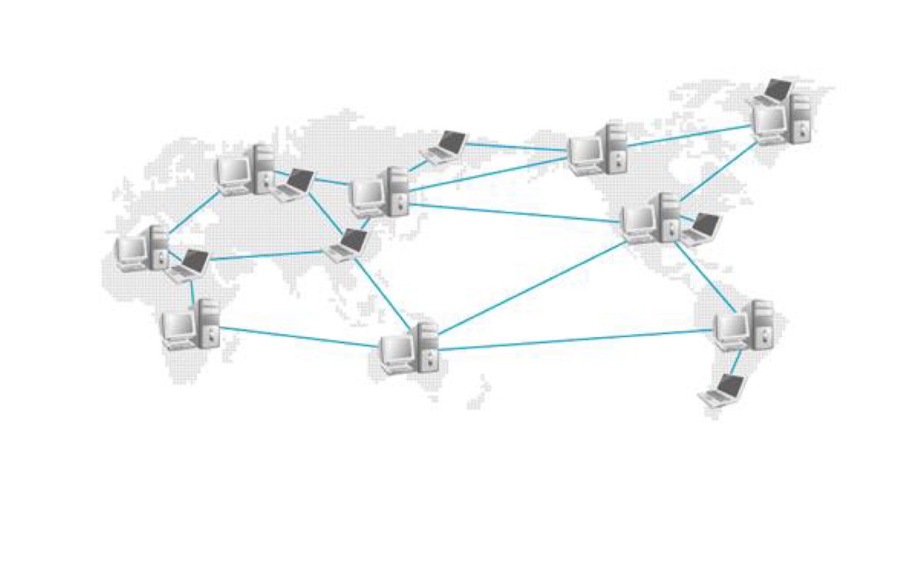

WAN

***
## 통신 방식

- 종류 :
    - 유니캐스트
    - 브로드캐스트
    - 멀티캐스트

- `서버` : 다른 컴퓨터에 데이터 전송 서비스를 제공하는 컴퓨터
- `클라이언트` : 서버에서 보내주는 데이터 서비스를 수신하는 컴퓨터
 -> 서버는 클라이언트(사용자)한테 요청 받아 서비스를 제공하는데, 이렇게 구성된 시스템을 `클라이언트/서버` 시스템이라고 한다.

클라이언트/서버

## 유니캐스트
- 네트워크에서 가장 많이 사용하는 유니캐스트(Unicast)는 서버와 클라이언트 간의 일대일(1:1) 통신 방식을 말한다
- 자신의 MAC(Media Access Control Address) 주소와 수신지 MAC 주소가 동일하다면 전송된 데이터를 수신하고, 자신의 LAN카드 MAC주소가 수신지 주소가 아니라고 판단되면 해당 프레임은 버림

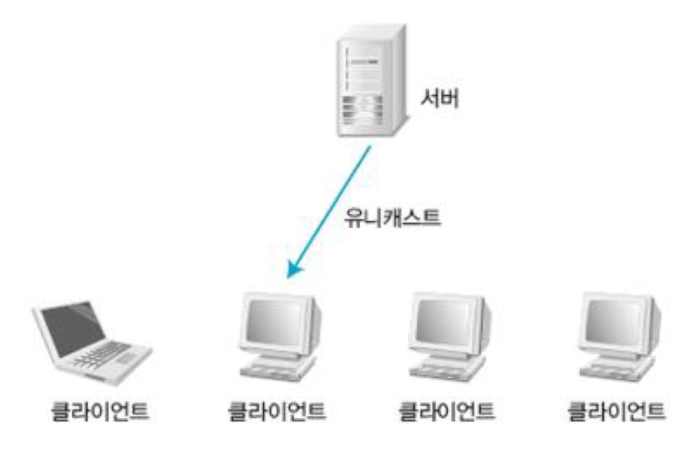

Unicast 방식

***
## 브로드캐스트
- 브로드캐스트(Broadcast)는 로컬 LAN에 있는 모든 네트워크 단말기에 데이터를 보내는 방식으로, 서버와 클라이언트 간에 일대모두(1:all)로 통신하는 데이터 전송 서비스다
- 브로드캐스트의 MAC주소는 `FF-FF-FF-FF-FF-FF`로 미리 정해져 있다
- 다른 라우터를 찾거나, 라우터끼리 데이터를 교환하거나, 서버가 서비스를 제공하려고 모든 클라이언트에게 알릴 때 등 여러 상황에서 사용
- 수신을 원치 않는 클라이언트도 수신하게 되므로 네트워크 *성능 저하*를 가져올 수 있음

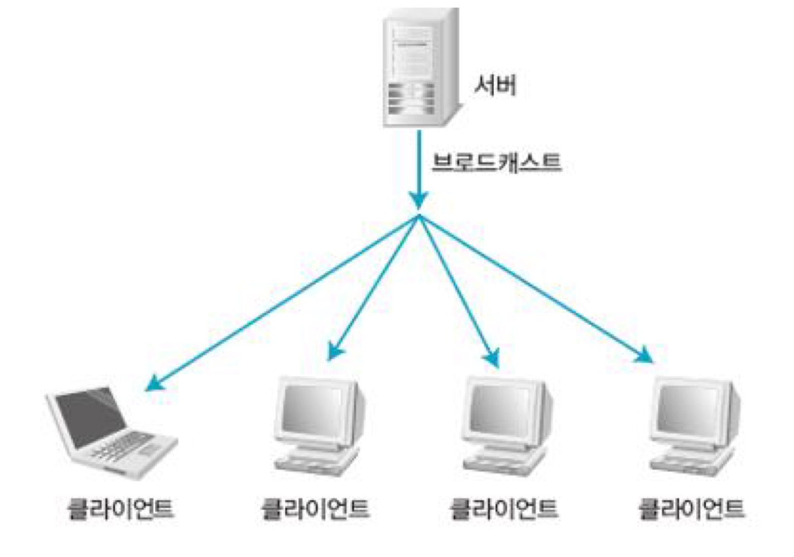

Broadcast 방식

***
## 멀티캐스트
- 멀티캐스트는 전송하려는 특정 그룹에게만 한 번에 전송할 수 있기 때문에 `유니캐스트`처럼 반복해서 보낼 필요가 없고, `브로드캐스트`처럼 전송받을 필요가 없는 컴퓨터에 보내지 않아도 됨

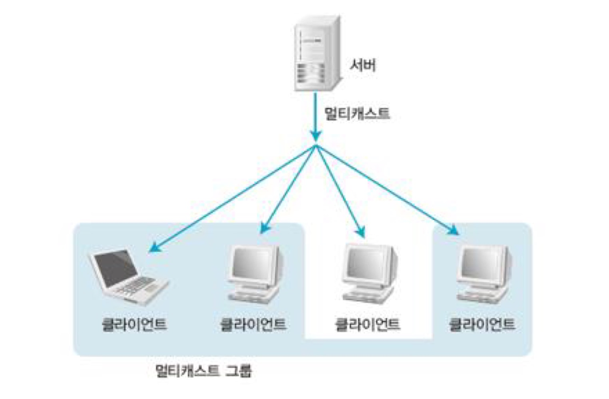

Multicast 방식

# 프로토콜(Protocol)
- 본래 의미는 외교에서 의례 또는 의정서
- 톰 마릴이 '컴퓨터와 컴퓨터 사이에서 메시지를 전달하는 과정'이라 정의
***
## 프로토콜의 3가지 요소
- `구문(Syntax)` : 데이터의 구조나 포맷을 의미
- `의미(Semantics)` : 전송되는 데이터의 각 부분이 무엇을 뜻하는지를 알 수 있게 미리 정해둔 규칙 
(데이터 자체뿐만 아니라 오류 제어, 동기 제어, 흐름 제어를 포함)
- `순서(timing)` : 어떤 데이터를 보낼 것인지와 얼마나 빠르게 데이터를 보낼 것인지 정의
***
## 프로토콜의 기능
- `주소 설정(Addressing)` : 서로 다른 시스템의 두 개체가 통신을 하는 경우 필요
- `순서 제어(Sequence Control)` : 프로토콜 데이터 단위를 전송할 때 보내는 순서를 명시하는 기능
- `데이터 대열의 단편화 및 재조합(Fragmentation & Reassembly)` : 대용량 파일을 전송할 때 전송 효율이 높은 작은 단위로 나누어 전송한 뒤 전송받은 시스템에서 이를 재조합 해야 함
- `캡슐화(Encapsulation)` : 데이터에 제어 정보를 추가
- `연결 제어(Connection Control)` : 연결 설정, 데이터 전송, 연결 해제에 대한 통제 수행
- `흐름 제어(Flow Control)` : 송신측 개체로부터 오는 데이터의 양이나 속도를 조절하는 기능, 속도 차이 등으로 인한 정보 유실 방지
- `오류 제어(Error Control)` : 두 개체에서 데이터를 교환할 때 오류가 발생한 경우, 이를 제어하는 기법
- `동기화(Synchronization)` : 두 개체 간에 데이터를 전송할 때 각 개체는 특정 타이머 값이나 윈도우 크기 등을 통해 동시에 정의된 인자 값을 공유하는 것
- `다중화(Multiplexing)` : 통신 선로 하나에서 여러 시스템을 동시에 통신할 수 있는 기법
- `전송 서비스` : 우선순위 결정, 서비스 등급과 보안 요구 등을 제어하는 서비스
***
# 네트워크 계층 구조
- OSI 7계층
## 1계층 : 물리 계층
- 실제 장치를 연결하는 데 필요한 전기적, 물리적 세부 사항을 정의
- 물리 계층의 장치로는 `허브`나 `리피터`가 있음
- 물리 계층 데이터 단위 : `비트열의 데이터(비트)`

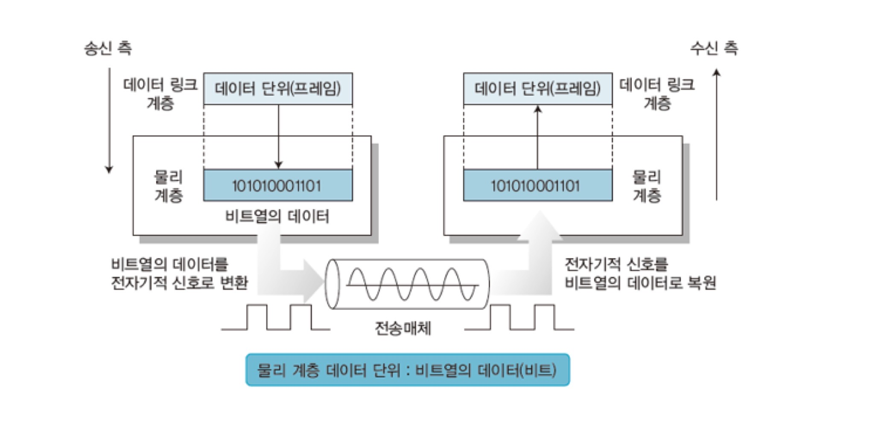

1계층 구조

## 2계층 : 데이터 링크 계층
- 점대점(Point-to-Point) 사이의 신뢰성 있는 전송을 보장하기 위한 계층
- CRC 기반의 오류 제어와 흐름 제어가 필요
- 가장 잘 알려진 예는 `이더넷`

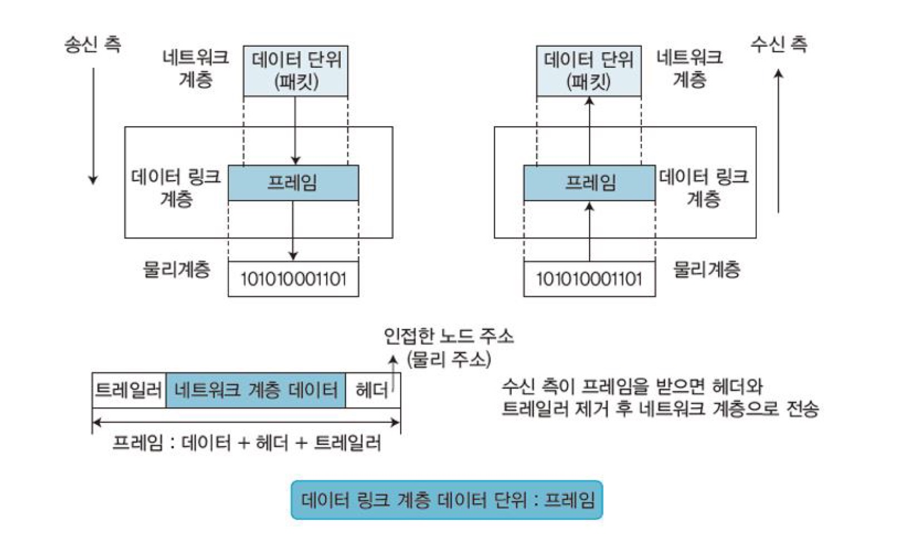

2계층 구조

***
- 물리적 링크를 이용하여 신뢰성 있는 데이터를 전송하는 계층
- 1계층(물리)의 비트를 프레임이라는 논리적 단위로 구성함
- 3계층(네트워크)에서 받은 데이터 단위(패킷)를 프레임으로 구성하여 1계층(물리)으로 전송함
- 데이터 링크 계층 데이터 단위 : `프레임`: (데이터 + 헤더 + 트레일러)
 -> `헤더`의 끝에는 필요한 정보가 들어있음 
`트레일러`에는 오류를 검출하는 특별한 비트가 있음
- 데이터 링크 계층의 물리적 주소는 MAC주소임 

***
## MAC 주소
- 총 12개의 16진수로 구성
- 앞쪽 6개는 네트워크 카드를 만든 회사, 뒤쪽 6개는 호스트 식별자(Host Identifier)로 각 회사에서 임의로 붙이는 일종의 시리얼
- 같은 MAC주소는 존재하지 않음
## 이더넷
- 2계층(데이터 링크)의 대표적인 프로토콜
### CSMA/CD (Carrier Sense Multiple Access / Collision Detection)
- 이더넷의 통신 방식
- 이더넷 환경에서 통신을 하고 싶을 때, Carrier Sense를 수행
- 복수개의 디바이스가 동시에 통신을 시작할 때, Collision이 발생하고 이를 Detection할 수 있음
- Collision Detection이 일어난 후, 랜덤한 시간을 기다린 후 다시 데이터를 보냄

## 3계층 : 네트워크 계층
- 여러 노드를 거칠 때마다 경로를 찾아주는 역할
- 라우팅, 흐름 제어, 단편화(Segmentation/Desegmatation), 오류 제어 등을 수행
- 대표적인 예는 `라우터`임, 또한 3계층에서 동작하는 스위치를 흔히 L3스위치라 함

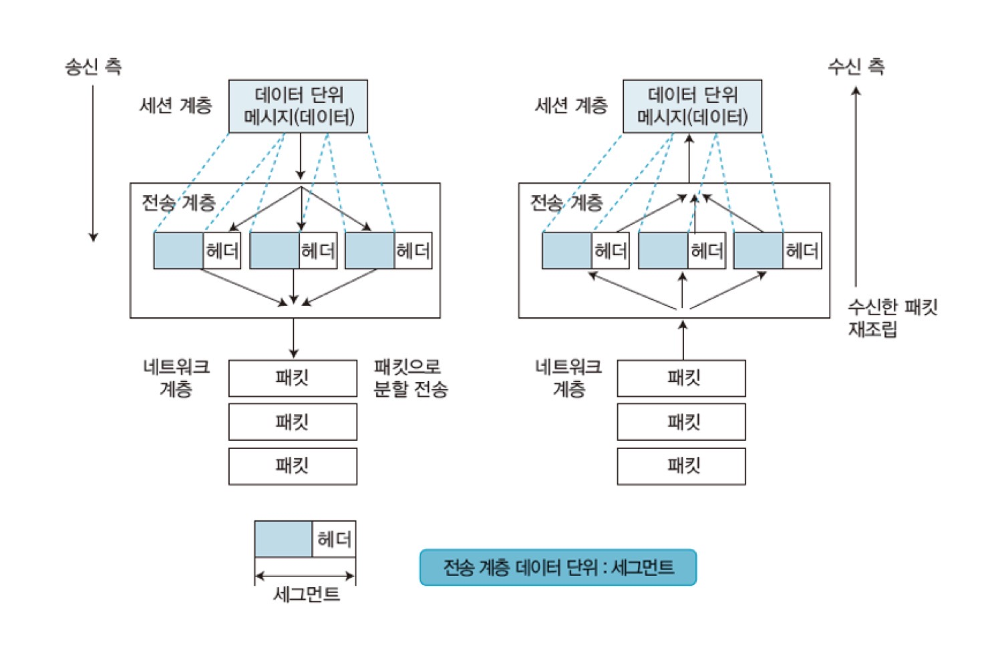

3계층 구조

***
- 랜(LAN)을 벗어난 통신을 하기 위해 네트워크 계층에서 `IP주소`를 사용
- `라우팅 프로토콜`을 사용하여 최적의 경로를 선택함
- 네트워크 계층은 데이터를 패킷 단위로 분할하여 전송한 후 재결합
- 네트워크 계층 데이터 단위 : `패킷` : (세그먼트 + 헤더)
***
## ARP (Address Resolution Protocol)
- 3계층(네트워크)의 프로토콜 중 하나
- IP 주소와 통신에 필요한 물리적인 주소(MAC)를 알아내는 프로토콜
- 선택된 매체에 `브로드캐스트`를 통해 특정 IP 주소를 사용하는 호스트가 응답을 하도록 요구하는 방식을 사용

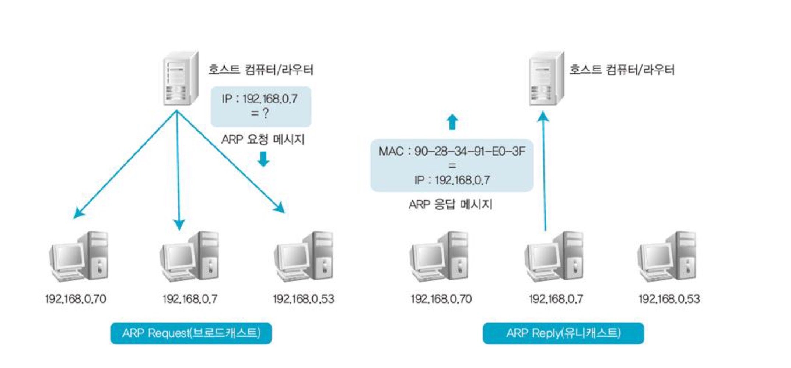

ARP

## IP (Internet Protocol)
- 가장 대표적인 3계층(네트워크)의 프로토콜
- 하위 계층의 서비스를 이용하여 두 노드 간의 데이터 전송 경로를 확립해주는 역할 (단말장치 간 패킷 전송 서비스)
## IP 주소 체계
- 32자리 2진수로, 8자리마다 점을 찍어 구분
- A, B, C, D, E 클래스로 구분하는데 각 클래스는 네트워크 부분과 호스트 부분으로 구성

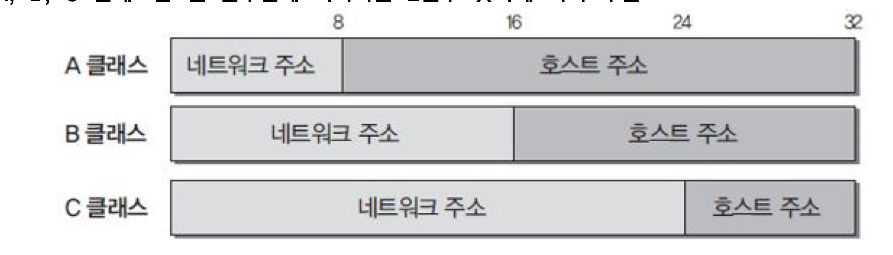

IP 구조

## ICMP (Internet Control Message Protocol)
- ICMP는 호스트 서버와 인터넷 게이트웨이 사이에서 메시지를 제어 및 오류를 알려주는 프로토콜
- 대표적인 툴은 ping
## 라우터
- 네트워크의 대표적인 장비로, 게이트웨이라고도 함
- 논리적으로 분리된 둘 이상의 네트워크를 연결
- 로컬 네트워크에서 브로드캐스트를 차단하여 네트워크를 분리
- 패킷의 최적 경로를 찾기 위한 `라우팅 테이블` 구성
- 패킷을 목적지까지 가장 빠르게 보내는 길잡이 역할 담당
## 정적 라우팅
- 관리자 권한으로 특정 경로를 통해서만 패킷이 지날 수 있도록 설정
- 네트워크 변경사항이 발생하면 라우팅 테이블을 수동으로 직접 고쳐야 함
- 보안이 중요한 경우 선호
- 특징 : 
    - 초기에 관리자가 분석한 최적의 경로 설정 가능
    - 라우팅 알고리즘 미사용으로 인해 처리 부하 감소
    - 네트워크 환경 변화에 대한 능동적인 대처 어려움
    - 비교적 환경 변화가 적은 형태의 네트워크에 적합

    
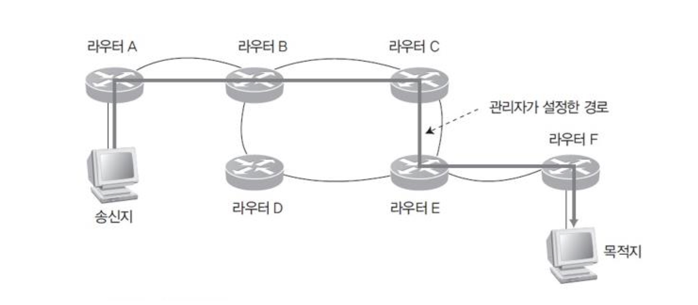

정적라우팅

## 동적 라우팅
- 라우터가 네트워크 연결 상태를 스스로 파악하여 최적의 경로를 선택해 전송
- 네트워크 연결 형태가 변경되어도 자동으로 문제를 해결
- 특징 :
    - 경로 설정이 실시간으로 이루어져 네트워크 환경 변화에 능동적 대처 가능
    - 주기적인 라우팅 정보 송수신으로 인한 대역폭 낭비 초래
    - 네트워크 환경 변화 시 라우터 처리 부하 증가로 지연 발생
    - 수시로 환경이 변하는 형태의 네트워크에 적합

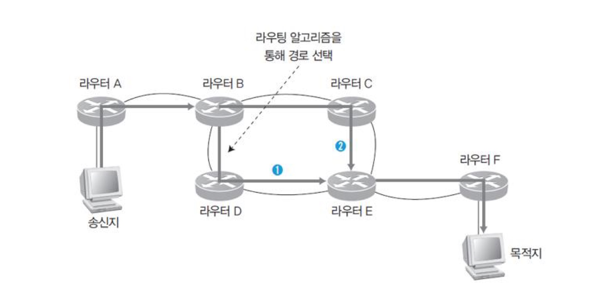

동적라우팅

## 4계층 : 전송 계층
- 양 끝단 사용자들이 신뢰성 있는 데이터를 주고받을 수 있게 하여 상위 계층이 데이터 전달의 유효성이나 효율성을 고려하지 않아도 되게 해줌
- 전송 계층에서 동작하는 프로토콜 중 TCP는 `연결지향(Connection-Oriented)` 프로토콜임

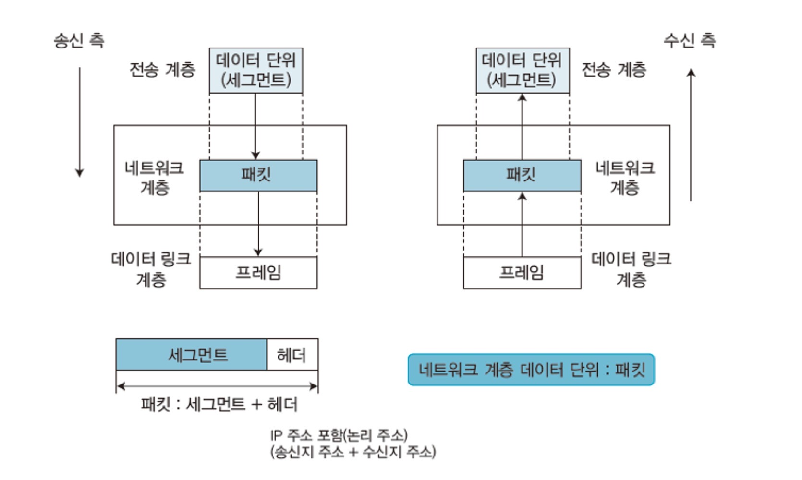

4계층 구조

***
- 프로토콜(TCP, UDP)과 관련된 계층으로 오류 복구와 흐름 제어 등을 담당하며, 두 시스템 간에 신뢰성 있는 데이터를 전송함
- 3계층(네트워크)에서 온 데이터를 5계층(세션)의 어느 애플리케이션에 보낼 것인지 판독하고, 전송할 경로(Port, 포트)를 선택함
- 전송 계층 데이터 단위 : `세그먼트`
## 포트
- 4계층(전송)의 대표 프로토콜인 `TCP`가 가진 주소
- 수신지 컴퓨터까지 전송하려면 IP주소와 물리 주소의 포트주소도 필요함
- 즉, 포트는 TCP가 상위 계층으로 데이터를 전달하거나 상위 계층에서 TCP로 데이터를 전달할 때 상호 간에 사용하는 데이터의 이동 통로를 말함
## TCP(Transmission Control Protocol)
- 연결 지향형 프로토콜
- IP와 함께 통신을 하는 데 반드시 필요한 가장 기본적인 프로토콜
- 특징 : 
    - 높은 신뢰성
    - 가상 회선 연결 방식
    - 연결의 설정과 해제
    - 데이터 체크섬
    - 시간 초과와 재전송
    - 데이터 흐름 제어
***
## 3-Way Handshaking

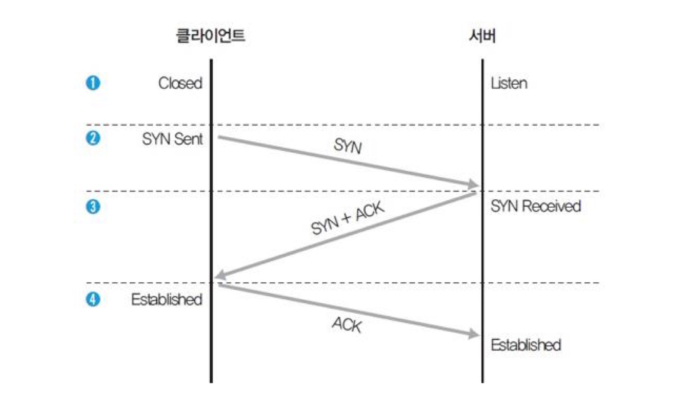

Handshaking 연결 과정

***

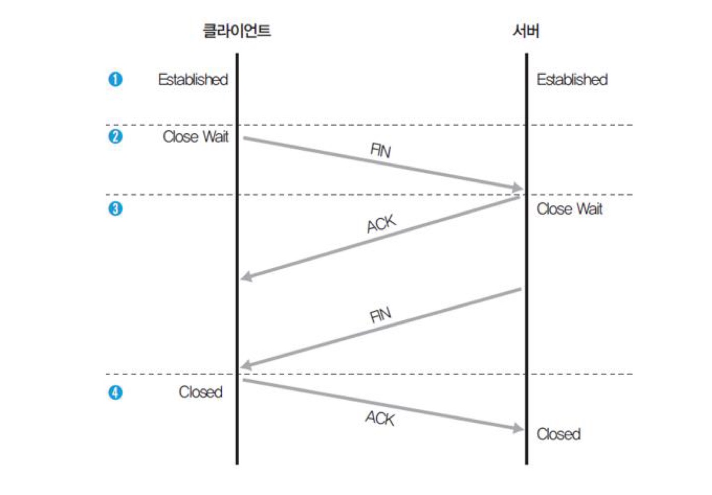

Handshaking 연결 해제 과정

## UDP(User Datagram Protocol)
- 비연결 지향형 프로토콜
- 상대방이 보낸 응답을 확인하지 않아 네트워크에 부하를 주지 않음
- 데이터 자체의 신뢰성이 없어 수신한 데이터의 무결성을 보장받지 못함
- 특징 :
    - 비연결 지향형
    - 네트워크 부하 감소
    - 비신뢰성
    - 전송된 데이터의 일부가 손실됨

## 5계층 : 세션 계층
- 양 끝단의 응용 프로세스가 통신을 관리하기 위한 방법을 제공
- TCP/IP 세션을 만들고 없애는 책임을 짐
***
- 응용 프로그램 계층 사이의 접속을 설정, 유지, 종료시켜주는 역할을 함
## 6계층 : 표현 계층
- 시스템에서 사용되는 코드 간의 번역을 담당
- 표현 계층은 data의 Format(형식)을 정의함
***
- 데이터 표현 차이를 해결하려고 서로 다른 형식으로 변환하거나 공통 형식을 제공하는 계층
## 7계층 : 응용 계층
- 사용자나 응용 프로그램 사이에 데이터 교환을 가능하게 하는 계층
- HTTP, FTP, 터미널 서비스, 메일 프로그램 등을 제공

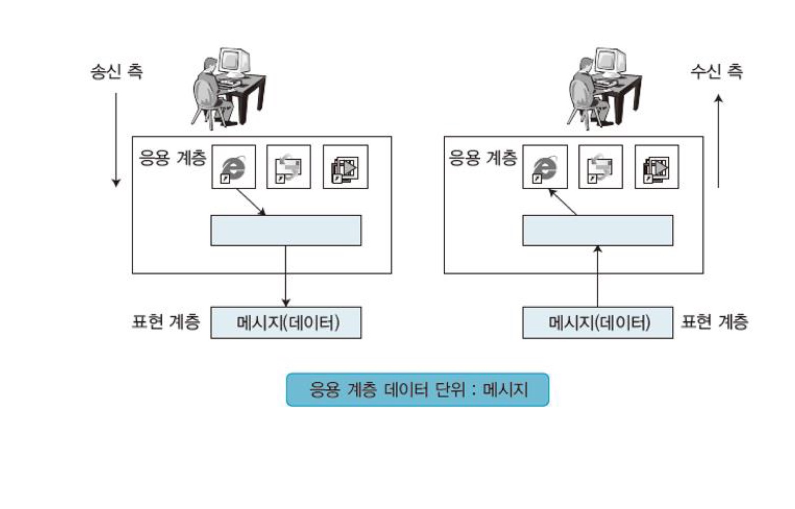

7계층 구조

***
- 관련 응용 프로그램이 별도로 존재하며, 여러 가지 프로토콜에 대하여 사용자인터페이스를 제공
- 응용 계층 데이터 단위 : `메시지`
***
## 응용 계층 관련 프로토콜
- FTP (File Transfer Protocol, 20, 21)
    - 파일 전송을 위한 가장 기본적인 프로토콜
    - 클라이언트와 서버가 대화형으로 통신 가능
    - 1972년 텔넷과 함께 표준으로 제정
- Telnet (텔넷, 23)
    - 사용자가 원격에 있는 서버에 로그인하도록 TCP연결을 설정
    - 단말기가 원격 컴퓨터 바로 옆에 있는 것처럼 직접 조작할 수 있게 해줌
- POP3 & IMAP
    - POP3(110) : 메일 서버로 전송된 메일을 확인할 때 사용하는 프로토콜
    - IMAP(143) : POP3와 기본적으로 같으나, 메일을 읽은 후 메일이 서버에 남음
- SMTP (Simple Mail Transfer Protocol, 25)
    - 메일 서비스
- DNS (Domain Name System, 53)
    - 도메인 이름 주소를 통해 IP 주소를 확일할 수 있는 프로토콜
- HTTP (HyperText Transfer Protocol, 80)
    - 인터넷을 위해 사용하는 가장 기본적인 프로토콜
***
