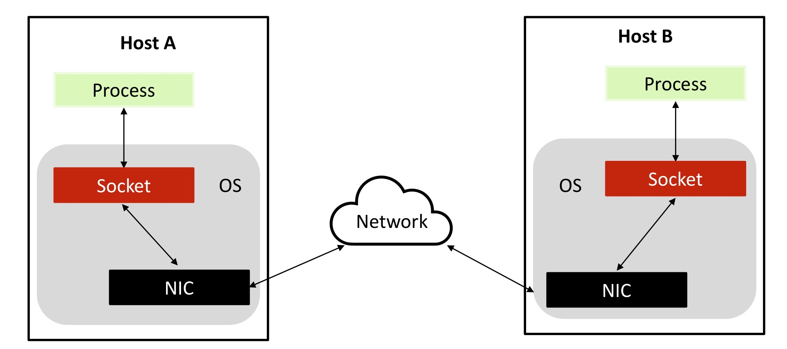

<!--
1. 이미지(가운데 정렬, 60%)
<center></center>

<p align = "center">
내용
</p>

-->
# 소켓과입출력
## Contents
 1. [소켓(Socket)?](#소켓socket)
    - [네트워크 프로그래밍](#네트워크-프로그래밍)
 1. [소켓과 입출력](#소켓과-입출력)
    - [파일 디스크립터 (File Descriptor)](#파일-디스크립터file-descriptor)
    - [리눅스의 기본 입출력 함수들](#리눅스의-기본-입출력-함수들)
        - [open()](#open)
        - [read()](#read)
        - [write()](#write)
        - [close()](#close)
        - [실습 1](#실습-1)
    - [소켓](#소켓)
        - [실습 2](#실습-2)
 1. [통신 프로토콜](#통신-프로토콜)
 1. [PF_INET vs AF_INET](#PF_INET-vs-AF_INET)


***
# 소켓(Socket)?
- 네트워크에서의 소켓 :
    - 네트워크 프로토콜의 통신 접점
    - 네트워크(인터넷)의 연결 도구
    - 운영체제에 의해 제공이 되는 소프트웨어적인 장치
    - 소켓은 프로그래머에게 데이터 송수신에 대한 물리적, 소프트웨어적 세세한 내용을 신경 쓰지 않게 함

<p align = "center"></p>
<p align = "center">
네트워크에서의 소켓
</p>

## 네트워크 프로그래밍
- `Socket API`를 이용하여 컴퓨터 네트워크를 사용하는 프로그램을 작성하는 것
- `Socket API`는 서로 다른 (또는 같은) 호스트상에서 실행되는 두 개의 (또는 이상의) 프로세스들이 컴퓨터 네트워크를 사용하여 통신하기 위해 제공되는 도구

<p align = "center"></p>
<p align = "center">
Socket API
</p>

***
# 소켓과 입출력
- 프로세스의 관점에서 소켓과 관련된 작업은 다른 프로세스로부터 데이터를 주고 받는 작업임<br>
-> 즉, 네트워크 프로그래밍은 입출력 잡업이 소켓기반으로 이루어짐
- 소켓은 여러 입출력 방법론 중 하나임
    - 표준 입출력, 파일, 장치, 터미널, <u>**소켓**</u>
    - 리눅스 시스템에서는 이러한 입출력 작업을 파일로 다루는 API로 추상화함
    - 따라서 ***소켓 입출력 작업을 위한 파일 디스크립터(File Descriptor)가 필요함***
***
## 파일 디스크립터(File Descriptor)
- 프로세스가 파일에 접근하기 위해서는 파일이 프로세스에 의해 열린 상태가 되어야 함
- 파일 디스크립터는 열린 파일들을 식별하기 위한 ***정보(숫자)*** 임

Name | File descritor | Abbreviation
:---:|:---:|:---:
Standard input|0|stdin
Standard output|1|stdout
Standard error|2|stderr

***
## 리눅스의 기본 입출력 함수들
- open
- read
- write
- close
***
### open()
```c
#include <sys/stat.h>
#include <fcntl.h>

int open(const char *path, int oflag, ...);
```
- Arguments
    - `path` : 파일 이름이나 경로
    - `oflag` : 

    이름 | 설명
    :---:|:---:
    O_RDONLY| 오직 읽기 위해 open
    O_WRONLY| 오직 쓰기 위해 open
    O_RDWR|읽고 쓰기 위해 open
    추가(선택)
    O_APPEND| 이어쓰기 모드
    O_CREAT|파일이 이미 존재하는 경우 효과 없음,<br> 그렇지 않으면 파일 생성
    O_EXCL| O_CREAT 플래그와 함께 사용
    O_TRUNC | 파일의 길이를 0으로 설정
- Return value
    - 오류가 없다면 사용되지 않은 파일 디스크립터의 `가장 작은 숫자`를 부여함, 오류 발생 시 `-1` 반환
    <br>ex) 오류가 없다면 3 리턴 (0, 1, 2는 사용되고 있음)
***
### read()
```c
#inlcude <unistd.h>

ssize_t read(int fd, void *buf, size_t count);
```
- fd로부터 count만큼 *buf에 저장함

- Arguments
    - `fd` : file descriptor
    - `buf` : buffer pointer
    - `count` : 읽어 올 최대 `bytes`
- Return value
    - 오류가 없다면 읽어온 `bytes`수를 리턴, 오류 발생 시 `-1` 리턴<br>
    +) `0`은 `EOF`의미
***
### write()
```c
#include <unistd.h>

ssize_t write(int fd, const void *buf, size_t count);
```
- fd로부터 count만큼 *buf의 값을 버퍼에 쓴다

- Arguments
    - `fd` : file descriptor
    - `buf` : buffer pointer
    - `count` : 읽어 올 최대 `bytes`
- Return value
    - 오류가 없다면, 쓴 `bytes` 수를 리턴, 오류 발생 시 `-1` 리턴
***
### close()
```c
#include <unistd.h>

int close(int fd);
```
- 사용했던 file descriptor를 닫는다

- Return value
    - 오류가 없다면 `0`리턴, 오류 발생 시 `-1` 리턴
***
### 실습 1
``` c
#include <stdio.h>
#include <fcntl.h>

int main(int argc, char ** argv){
    int fD, wirteLen, readLen;
    char rBuff[BUFSIZ];     // default 8192

    // 명령 인자 오류
    if(argc != 2){
        fprintf(stderr, "Usage : %s [Filename] \n", argv[0]);
        return 0;
    }

    // 키보드(fD:0)로부터 BUFSIZ-1 bytes만큼 읽어서 rBuff에 저장
    readLen = read(0, rBuff, BUFSIZ - 1);
    if(readLen == -1){
        fprintf(stderr, "Read Error \n");
        return 0;
    }
    printf("Total reading data: %d\n", readLen);

    rBuff[readLen] = '\0';      // 마지막에 \0 추가
    fD = open(argv[1], O_WRONLY|O_CREAT|O_TRUNC);
    if(fD == -1){
        fprintf(stderr, "Open Error \n");
        return 0;
    }

    // fd에 readLen + 1만큼 rBuff의 값을 버퍼에 쓴다
    writeLen = write(fD, rBuff, readLen + 1);
    if(writeLen == -1){
        fprintf(stderr, "Write Error \n");
        return 0;
    }
    printf("Total writing data: %d\n", readLen);
    
    close(fD);      // 사용한 fD 닫기

    return 0;
}
```
***
## 소켓
```c
#include <sys/socket.h>

int socket(int domain, int type, int protocol);
```
-> 성공 시 `파일 디스크립터`, 실패 시 `-1` 반환

- Arguments
    - `domain` : 소켓이 사용할 `프로토콜 체계(Protocol Family)` 정보 전달
    - `type` : 소켓의 데이터 전송방식에 대한 정보 전달
    - `protocol` : 두 컴퓨터 간 통신에 사용되는 프로토콜 정보 전달

- domain

이름 | 프로토콜 체계 (Protocol Family)
:---: | :---:
PF_INET | IPv4 인터넷 프로토콜 체계
PF_INET6 | IPv6 인터넷 프로토콜 체계
PF_LOCAL|로컬 통신을 위한 UNIX 프로토콜 체계
PF_PACKET|Low Level 소켓을 위한 프로토콜 체계
PF_IPX | IPX 노벨 프로토콜 체계

- type
    - `SOCK_STREAM` : TCP 소켓
    - `SOCK_DGRAM` : UDP 소켓
    - `SOCK_RAW` : 사용자 정의 4계층 통신

- protocol
    - `IPPROTO_TCP` : TCP 프로토콜
    - `IPPROTO_UDP` : UDP 프로토콜
    <br>
    +) 해당 매크로 대신 `0` 입력 시 자동으로 각 프로토콜(TCP, UDP)로 연결 됨
***
### 실습 2
``` c
#include <sys/socket.h>
#include <stdio.h>
#include <fcntl.h>

int main(){
    int sD1, fD1, sD2, fD2;

    sD1 = socket(PF_INET, SOCK_STREAM, 0);      // IPv4, TCP 소켓, TCP 프로토콜
    fD1 = open("test1", O_RDONLY|O_CREAT);
    sD2 = socket(PF_INET, SOCK_STREAM, 0);
    fD2 = open("test2", O_RDONLY|O_CREAT);

    printf("sD1:%d, fD1:%d, sD2:%d, fD2:%d \n", sD1, fD1, sD2, fD2);

    close(sD1);
    close(fD1);
    close(sD2);
    close(fD2);

    return 0;
}
```
***
# 통신 프로토콜
- 전송 계층 프로토콜
    - 컴퓨터 네트워크의 궁극적인 목적은 ***다른 호스트상에서 실행되고 있는 프로세스 간의 통신임***
    - 프로세스는 다음과 같이 프로세스 ID(PID)로 식별가능함

<p align = "center"></p>
<p align = "center">
프로세스 ID (PID)
</p>

***
- 하지만, 다른 호스트에 존재하는 프로세스와 통신을 위해 PID가 필요하지는 않음
- 네트워크 계층 주소 (IP주소)를 통해 전달 된 ***데이터는 전송계층에서 제공하는 포트를 통해 프로세스에 전달됨***

<p align = "center"></p>
<p align = "center">
전송 계층 프로토콜
</p>

***
# PF_INET vs AF_INET
- PF_INET

이름 | 프로토콜 체계 (Protocol Family)
:---: | :---:
PF_INET | IPv4 인터넷 프로토콜 체계
PF_INET6 | IPv6 인터넷 프로토콜 체계
PF_LOCAL|로컬 통신을 위한 UNIX 프로토콜 체계
PF_PACKET|Low Level 소켓을 위한 프로토콜 체계
PF_IPX | IPX 노벨 프로토콜 체계

- AF_INET

이름 | 주소 체계 (Address Family)
:---: | :---:
AF_INET | IPv4 인터넷 프로토콜에 적용하는 주소 체계
AF_INET6 | IPv6 인터넷 프로토콜에 적용하는 주소 체계
AF_LOCAL|로컬 통신을 위한 UNIX 프로토콜의 주소 체계
***
> "The protocol family generally is the same as the address family", and subsequent standards use AF_* everywhere.
    >> 출처 : https://man7.org/linux/man-pages/man2/socket.2.html

- 엄밀히는 다르지만 현재에는 구분 없이 사용 중임을 알 수 있다
