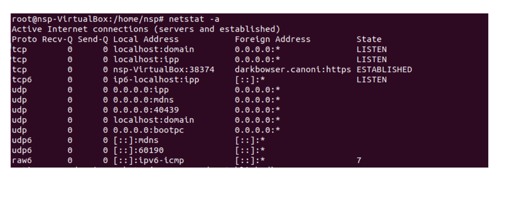

<!--
1. 이미지(가운데 정렬, 60%)
<p align = "center"></p>
<p align = "center">
내용
</p>

-->
# 소켓 API (1)
## Contents
 1. [네트워크 주소](#네트워크-주소)
    - [네트워크 주소 : IP 주소](#네트워크-주소--ip-주소)
    - [네트워크 주소 : CIDR](#네트워크-주소--cidr)
    - [네트워크 주소 : loopback 인터페이스](#네트워크-주소--loopback-인터페이스)
    - [네트워크 주소 : 포트 번호](#네트워크-주소--포트-번호)
 1. [소켓 주소](#소켓-주소)
    - [소켓 주소 관련 구조체](#소켓-주소-관련-구조체)
    - [bind()](#bind)
 1. [바이트 순서](#바이트-순서)
    - [htonl()과 ntohl()](#htonl과-ntohl)
 1. [주소 변환](#주소-변환)
    - [inet_addr()](#inetaddr)
    - [inet_network](#inetnetwork)
    - [inet_aton()](#inetaton)
    - [inet_ntoa()](#inetntoa)
    - [inet_pton()과 inet_ntop()](#inetpton과-inetntop)
        - [inet_pton()](#inetpton)
        - [inet_ntop()](#inetntop)
    - [실습 1 : ip-uint](#실습-1--ip-uint)

***
# 네트워크 주소
- 다른 호스트상에서 실행중인 두 프로세스가 정보를 주고 받으려면 두 개의 주소가 필요함
    - 호스트를 식별하기 위한 ***IP 주소***
    - 호스트에 도착한 데이터를 해당 프로세스에 전달하기 위한 ***포트 번호***
***
## 네트워크 주소 : IP 주소
- `IPv4`는 32비트, `IPv6`는 128비트 사용
- `IPv4`는 8비트 단위로 .(dot)로 구분하여 10진수 4개로 표기
    - `147.46.114.70`
- `IPv6`는 16비트 단위로 :(colon)으로 구분하여 16진수 8개로 표기
    - `2001:0230:abcd:ffab:0023:eb00:ffff:1111`

- IP주소는 주소의 범위에 따라 A, B, C, D, E 5개의 클래스로 구분됨
    - 32비트의 `IPv4` 주소의 앞부분은 네트워크 주소를 의미하고, 뒷부분은 호스트 주소를 의미함
<p align = "center"></p>
<p align = "center">
IPv4 Class
</p>

***
## 네트워크 주소 : CIDR
- `CIDR(Classless Inter-Domain Routing)`
    - 네트워크 주소를 바이트 별로 구분할 경우, 주소공간을 효율적으로 할당하기 어려움
    - 따라서, 유연하게 네트워크 주소와 호스트 주소를 나눌 수 있는 CIDR 방법이 제안됨
    - `10.10.1.32/27`
    - 상위 27비트는 네트워크 주소
<p align = "center"></p>
<p align = "center">
CIDR
</p>

***
## 네트워크 주소 : Loopback 인터페이스
- `Loopback` 주소는 호스트를 지칭하는 주소임
- `IPv4`의 경우 `127.0.0.1`로 사용함
***
## 네트워크 주소 : 포트 번호
- Well-Known Port: 0 ~ 1023
    - 22 (SSH)
    - 23 (Telnet)
    - 53 (DNS)
    - 80 (HTTP)
    - 443 (HTTPS)
<p align = "center"></p>
<p align = "center">
Port Number
</p>

***
# 소켓 주소
- 네트워크 통신을 위해서는 아래 사항이 결정되어야 함
    - 전송 계층 프로토콜 : TCP, UDP
    - 네트워크 계층 프로토콜 : IP
    - `Source` / `Destination` 호스트의 IP주소
    - `Source` / `Destination` 프로세스의 포트 번호
***
## 소켓 주소 관련 구조체
```c
struct sockaddr{
    sa_family_t sa_family;      // address family, AF_xxx
    char sa_data[14];           // 14 bytes of protocol address
};

struct sockaddr_in{
    sa_family_t sin_family;     // address family: AF_INET
    in_port_t sin_port;         // port in network byte order(Big-Endian)
    struct in_addr sin_addr;    // internet address
};

//Internet address
struct in_addr{
    uint32_t s_addr;            // address in network byte order(Big-Endian)
};
```
***
## bind()
- 소켓에 주소를 설정하는 함수
```c
#include <sys/types.h>
#include <sys/socket.h>

int bind(int sockfd, const struct sockaddr *addr, socklen_t addrlen);
```
- 오류가 없다면, `0` 리턴,
오류 발생 시, `-1` 리턴함
***
# 바이트 순서
- 메모리에 데이터를 저장할 때 바이트 순서
    - `빅 엔디안(Big-Endian)` : 상위 바이트 값이 메모리의 작은 주소에 저장
    - `리틀 엔디안(Little-Endian)` : 하위 바이트 값이 메모리의 작은 주소에 저장
<p align = "center"></p>
<p align = "center">
Big-Endian과 Little-Endian
</p>

- 바이트 순서를 왜 고려해야 하지?
    - ***프로토콜 구현을 위해 필요한 정보***
        - IP 주소 -> `빅 엔디안`
        - 포트 번호 ->`빅 엔디안`
    - ***응용 프로그램이 주고 받는 데이터***
        - `빅 엔디안` 또는 `리틀 엔디안`으로 통일
        <br>    -> `intel` 계열의 경우 리틀 엔디안을 사용함

- 참고 : 
    - `네트워크 바이트 정렬(Network byte ordering)` : <br>
    빅 엔디안 방식
    - `호스트 바이트 정렬(Host byte ordering)` : <br>
    시스템이 사용하는 고유한 바이트 정렬 방식<br>
    -> 앞으로 나올 호스트 바이트 정렬은 `리틀 엔디안`을 뜻 함

***
## htonl()과 ntohl()
- `Intel` 계열 컴퓨터는 `리틀 엔디언 방식`을 사용하므로 네트워크로 데이터를 전송하기 전에 `빅 엔디언 방식`으로 변경해야 함
```c
#include <arpa/inet.h>

uint32_t htonl(uint32_t hostlong);          // host-to-network-long
uint16_t htons(uint16_t hostshort);         // host-to-network-short
uint32_t ntohl(uint32_t netlong);           // network-to-host-long
uint16_t ntohs(uint16_t netshort);          // network-to-host-short
```
- 이미 `네트워크 바이트 오더`(빅 엔디언 방식)을 사용하는 컴퓨터라면 `htons()`와 `htonl()`함수를 사용해도 값은 바뀌지 않음
***
- ex)
```c
struct sockaddr_in srvAddr;
int port = 9001;
...
srvAddr.sin_port = htons(port);
```
<p align = "center"></p>
<p align = "center">
hton(), ntoh()
</p>

***
# 주소 변환
- IP 주소 변환 함수 (Dotted-Decimal 변환)
```c
#include <sys/socket.h>
#include <netinet/in.h>
#include <arpa/inet.h>

in_addr_t inet_addr(const char *cp);
in_addr_t inet_network(const char *cp);
int inet_aton(const char *cp, struct in_addr *inp);
char *inet_ntoa(struct in_addr in);
```
***
## inet_addr()
- 문자열 형태로 IPv4 주소 입력 (ex: 127.0.0.1)<br>
-> 32비트 숫자(***네트워크*** 바이트 정렬)로 리턴
## inet_network()
- 문자열 형태로 IPv4 주소 입력 (ex: 127.0.0.1)<br>
-> 32비트 숫자(***호스트*** 바이트 정렬)로 리턴
## inet_aton()
- Ipv4주소를 32비트 숫자(***네트워크*** 바이트 정렬)로 바꾸어 구조체(`in_addr`)에 저장함
## inet_ntoa()
- 32비트 숫자(***네트워크*** 바이트 정렬)로 IPv4 주소 입력<br>
-> 문자열 형태로 리턴
***
## inet_pton()과 inet_ntop()
- p는 presentation, n은 numeric(Network)를 뜻함
    - p는 주소를 위한 ASCII string 형식이다
    - n은 소켓 주소 구조체에 들어가는 이진 값의 형식
### inet_pton()
- 함수 원형 :
```c
#include <sys/types.h>
#include <sys/socket.h>
#include <arpa/inet.h>

int inet_pton(int af, const char *src, void *dst);
```
- char형 포인터 src를 af(Address Family)의 네트워크 주소 구조체로 변환한다, 그 후 dst로 네트워크 주소를 복사한다
***
### inet_ntop()
```c
#include <arpa/inet.h>

const char *inet_ntop(int af, const void *src, char *dst, socklen_t size);
```
- af(Address Family)의 네트워크 주소 구조체(src)를 char형 포인터로 변환한다, 그 후 변환된 값을 dst로 복사한다
***
- 응용 프로그램이 소켓 주소 구조체를 초기화하고, 소켓 함수에 넘겨주는 경우
```c
// 소켓 구조체 초기화
sockaddr_in addr;
ZeroMemory(&addr, sizeof(addr));        // 0으로 채운다
addr.sin_family = AF_INET;
addr.sin_addr.s_addr = inet_addr("147.46.114.70");
addr.sin_port = htons(9000);

// 소켓 함수를 호출한다
SocketFunc(..., (sockaddr *)&addr, sizeof(addr), ...);
)
```
***
- 소켓 함수가 소켓 주소 구조체를 입력으로 받아 내용을 채우면, 응용 프로그램이 이를 출력 등의 목적으로 사용하는 경우
```c
sockaddr_in addr;
int addrlen = sizeof(addr);
SocketFunc(...,(sockaddr *)&addr, &addrlen, ...);

// 소켓 주소 구조체를 사용한다
printf("IP 주소 = %s, 포트 번호 = %d\n", inet_ntoa(addr.sin_addr), ntohs(addr.sin_port));
```
***
## 실습 1 : ip-uint
```c
#include <netinet/in.h>
#include <stdio.h>
#include <arpa/inet.h>

int main(int argc, char** argv){
    uint32_t ipInInt;
    char *ipInStr = "127.0.0.1";        // loopback주소
    ipInInt = inet_network(ipInStr);    // host byte ordering

    printf("String: %s, Deciaml: %u, Hex: %X \n", ipInStr, ipInInt, ipInInt);

    ipInInt = htonl(ipInInt);           // network byte ordering
    printf("After htonl - Decimal: %u, Hex: %X \n", ipInInt, ipInInt);

    return 0;
}
}
```
- 실행 결과 :
<p align = "center"></p>
<p align = "center">
실습 1 : ip-uint 결과
</p>

- Hex의 결과 값이 위(`Host byte ordering`),아래(`Network byte ordering`)가 다름을 알 수 있다.

***
- `inet_network()` + `htonl()` -> `inet_addr()`이므로
위 프로그램을 다음과 같이 변경할 수 있다.
```c
#include <netinet/in.h>
#include <stdio.h>
#include <arpa/inet.h>

int main(int argc, char** argv){
    uint32_t ipInInt;
    char *ipInStr = "127.0.0.1";        // loopback주소
    ipInInt = inet_addr(ipInStr);    // network byte ordering

    printf("String: %s, Deciaml: %u, Hex: %X \n", ipInStr, ipInInt, ipInInt);

    return 0;
}
```
- 실행 결과 :
<p align = "center"></p>
<p align = "center">
실습 1 : ip-uint 프로그램 변경 결과
</p>

***