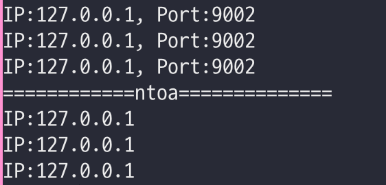
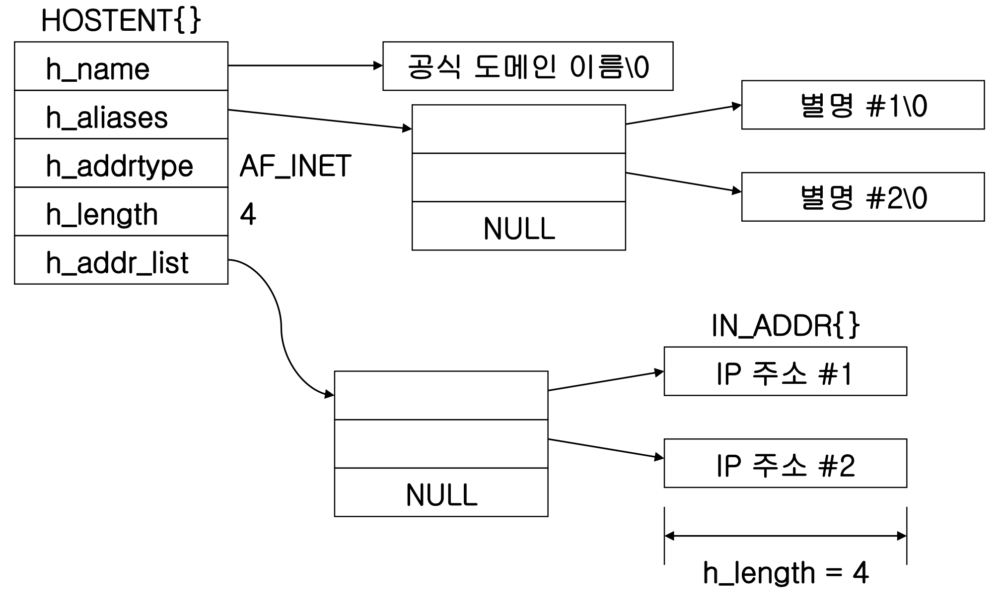
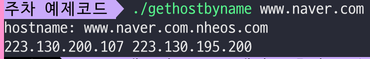
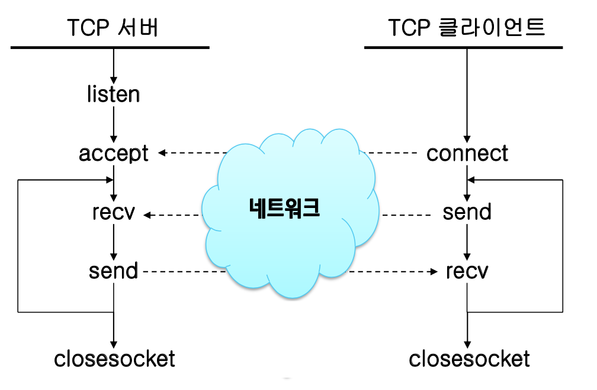
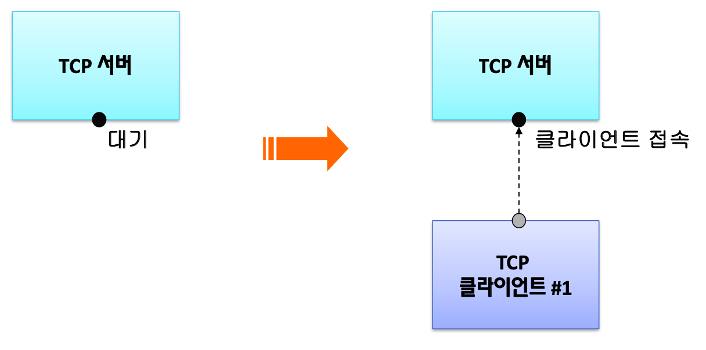
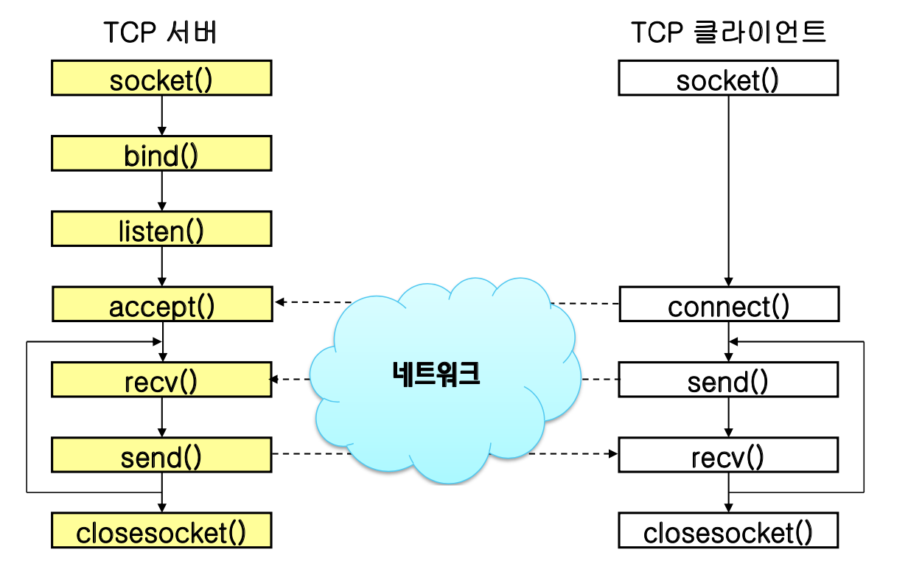
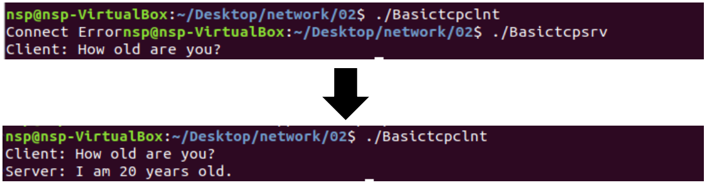

<!--
1. 이미지(가운데 정렬, 60%)
	<p align = "center"></p>
	<p align = "center">
	내용
	</p>

	-->
# 소켓 API (2)
## Contents
1. [실습 02 : address-resolution](#실습-02--address-resolution)
1. [호스트 이름과 IP 주소](#호스트-이름과-IP-주소)
1. [실습 03 : getbyhostname](#실습-03--getvyhostname)
1. [소켓 프로그램](#소켓-프로그램)
	- [listen()](#listen)
	- [accept()](#accept)
	- [connect()](#connect)
	- [send()](#send)
	- [recv()](#recv)
1. [실습 04 : basictcpsrv](#실습-04--basictcpsrv)
1. [실습 04 : basictcplnt](#실습-04--basictcplnt)

***
# 실습 02 : address-resolution
```c
#include <stdio.h>
#include <sys/socket.h>
#include <netinet/in.h>
#include <arpa/inet.h> 

	int printAddr(struct sockaddr_in *);
int main(int argc, char** argv) 
{
	char *sampleIP = "127.0.0.1";
	int port = 9002;

	struct sockaddr_in sockAddr1, sockAddr2, sockAddr3;

	sockAddr1.sin_family = AF_INET; // IPv4 사용
	sockAddr1.sin_addr.s_addr = inet_addr(sampleIP); // IPv4를 Network byte order로 변환
	sockAddr1.sin_port = htons(port); // host-to-network

	sockAddr2.sin_family = AF_INET;
	inet_aton(sampleIP,&(sockAddr2.sin_addr)); // IPv4를 network byte order로 변환 후 구조체 전달
	sockAddr2.sin_port = htons(port);

	sockAddr3.sin_family = AF_INET;
	inet_pton(AF_INET, sampleIP, &(sockAddr3.sin_addr)); // IPv4를 ASCII string으로 변환 하여 구조체에 저장
	sockAddr3.sin_port = htons(port);

	printAddr(&sockAddr1);
	printAddr(&sockAddr2);
	printAddr(&sockAddr3);

	printf("============ntoa==============\n");
	printf("IP:%s \n",inet_ntoa(sockAddr1.sin_addr)); // network byte order -> IPv4 변환
	printf("IP:%s \n",inet_ntoa(sockAddr2.sin_addr));
	printf("IP:%s \n",inet_ntoa(sockAddr3.sin_addr));

	return 0;
}
int printAddr(struct sockaddr_in *myAddr)
{
	int port;
	char txt[INET_ADDRSTRLEN];
	port = ntohs(myAddr->sin_port);
	inet_ntop(AF_INET,&(((struct sockaddr_in *)myAddr)->sin_addr),
			txt,sizeof(struct sockaddr_in));
	printf("IP:%s, Port:%d \n",txt,port);
	return 0;
}

```

***
- 실행 결과)
<p align = "center"></p>
<p align = "center">
address-resolution
</p>

***
# 호스트 이름과 IP 주소
- 호스트 이름을 이용하여 IP주소를 조회할 수 있음
```c
#include <netdb.h>

struct hostent *gethostbyname(const char *name);
```
- 네임서버에 존재하는 hostent의 구조체를 활용함
```c
struct hostent{
	char *h_name;
	char **h_aliases;
	int h_addrtype;
	int h_length;
	char **h_addr_list;
}
```
***

<p align = "center"></p>
<p align = "center">
hostent 구조체
</p>

***

# 실습 03 : getbyhostname
```c
#include <stdio.h>
#include <netdb.h>
#include <errno.h>
#include <sys/types.h>
#include <sys/socket.h>
#include <netinet/in.h>
#include <stdlib.h>
#include <arpa/inet.h>
#include <string.h>
void errProc(const char *);
int main(int argc, char **argv)
{
	struct hostent *ent;
	struct in_addr **res;
	int i = 0;
	if(argc != 2)
	{
		fprintf(stderr,"Usage: %s <hostname> \n", argv[0]);
		return -1;
	}

	ent = gethostbyname(argv[1]);
	if(ent == NULL) errProc("gethostbyname");

	res = (struct in_addr **)ent->h_addr_list;
	printf("hostname: %s \n",ent->h_name);
	while(res[i] != NULL)
	{
		printf("%s ", inet_ntoa(*res[i]));
		i++;
	}
	printf("\n");

}

void errProc(const char *str)
{
	fprintf(stderr,"%s: %s\n",str,strerror(errno));
	exit(errno);
}

```	
***
- 실행 결과)
<p align = "center"></p>
	<p align = "center">
	getbyhostname
	</p>

***
# 소켓 프로그램
- TCP 서버-클라이언트 핵심 동작
<p align = "center"></p>
	<p align = "center">
	tcp 서버-클라이언트 핵심 동작
	</p>

***
- TCP 서버-클라이언트 동작 원리
<p align = "center"></p>
	<p align = "center">
	tcp 서버-클라이언트 동작 원리
	</p>

***
- TCP 서버-클라이언트 예제 동작
<p align = "center"></p>
	<p align = "center">
	tcp 서버-클라이언트 예제 동작
	</p>

***

## listen()
```c
#include <sys/types.h>
#include <sys/socket.h>

int listen(int sockfd, int backlog);
```
- Arguments
	- sockfd : 소켓에 대한 파일 디스크립터
	- backlog : 최대 큐 길이
- Return value
	- 오류가 없으면 `0`반환, 오류 발생 시 `-1`반환
***
## accept()
```c
#include <sys/types.h>
#include <sys/socket.h>

int accept(int sockfd, (struct sockaddr *)restrict addr, socklen_t *restrict addrlen);
```
- Arguments
	- sockfd : 소켓에 대한 파일 디스크립터
	- addr : 연결된 entity의 주소
	- addrlen : addr의 길이
- Return value
	- 오류가 없으면 양의 정수(fd)반환, 오류 발생 시 `-1`반환
***

## connect()
```c
#include <sys/types.h>
#include <sys/socket.h>

int connect(int sockfd, const(struct sockaddr *)restrict addr, socklen_t addrlen);
```
- Arguments
	- sockfd : 소켓에 대한 파일 디스크립터
	- addr : 연결된 entity의 주소
	- addrlen : addr의 길이
- Return value
	- 오류가 없으면 `0`반환, 오류 발생 시 `-1`반환
***

## send()
```c
#include <sys/types.h>
#include <sys/socket.h>

ssize_t send(int sockfd, const void *buf,size_t len, int flags);
```
- Arguments
	- sockfd : 소켓에 대한 파일 디스크립터
	- buf : 보내는 메시지 버퍼
	- len : 보내는 메시지 길이
	- flag : --
- Return value
	- 오류가 없으면 전송된`bytes`반환, 오류 발생 시 `-1`반환
***
## recv()
```c
#include <sys/types.h>
#include <sys/socket.h>

ssize_t recv(int sockfd, void *buf,size_t len, int flags);
```
- Arguments
	- sockfd : 소켓에 대한 파일 디스크립터
	- buf : 보내지는 메시지 버퍼
	- len : 보내지는 메시지 길이
	- flag : --
- Return value
	- 오류가 없으면 받은 `bytes`반환, 오류 발생 시 `-1`반환
***
# 실습 04-1 : basictcpsrv
```c
#include <stdio.h>
#include <netinet/in.h>
#include <sys/socket.h>
#include <string.h>
#include <arpa/inet.h>
#define PORT 9001

int main()
{
	int srvSd, clntSd;
	struct sockaddr_in srvAddr, clntAddr;
	int clntAddrLen, readLen;
	char rBuff[BUFSIZ];
	char wBuff[] = "I am 20 years old.";
	
	
	srvSd = socket(AF_INET, SOCK_STREAM, 0);
	if(srvSd == -1)
	{
		printf("Socket Error\n");
		return -1;
	}	
	memset(&srvAddr, 0, sizeof(srvAddr));
	srvAddr.sin_family = AF_INET;
	srvAddr.sin_addr.s_addr = htonl(INADDR_ANY);
	srvAddr.sin_port = htons(PORT);
	if(bind(srvSd, (struct sockaddr *) &srvAddr, sizeof(srvAddr)) == -1)
	{
		printf("Bind Error");
		return -1;
	}
	if(listen(srvSd, 5) == -1)
	{
		printf("Listen Error");
		return -1;	
	}
	clntAddrLen = sizeof(clntAddr);
	clntSd = accept(srvSd, (struct sockaddr*)&clntAddr, &clntAddrLen);
	if(clntSd == -1)
	{
		printf("Accept Error");
		return -1;
	}
	
	readLen = read(clntSd, rBuff, sizeof(rBuff)-1);
	if(readLen == -1) 
	{
		printf("Read Error");
		return -1;
	}
	rBuff[readLen] = '\0';
	printf("Client: %s \n", rBuff);
	
	
	write(clntSd, wBuff, sizeof(wBuff));
	close(clntSd);
	close(srvSd);	
	
	return 0;	
}
```

# 실습 04-2 : basictcpclnt

```
#include <stdio.h>
#include <netinet/in.h>
#include <sys/socket.h>
#include <string.h>
#define PORT 9001

int main()		
{		
	int clntSd;	
	struct sockaddr_in clntAddr;	
	int clntAddrLen, readLen;	
	char wBuff[] = "How old are you?";	
	char rBuff[BUFSIZ];	
		
		
		
	clntSd = socket(PF_INET, SOCK_STREAM, 0);	
	if(clntSd == -1)	
	{	
		printf("Socket Creation Error");
		return -1;
	}	
	clntAddr.sin_family = AF_INET;	
	clntAddr.sin_addr.s_addr = inet_addr("127.0.0.1");	
	clntAddr.sin_port = htons(PORT);	
		
	if(connect(clntSd, (struct sockaddr *) &clntAddr, sizeof(clntAddr)) == -1)	
		
		
	{	
		printf("Connect Error");
		close(clntSd);
		return -1;
	}	
		
		
		
	write(clntSd, wBuff, sizeof(wBuff));	
	printf("Client: %s\n",wBuff);	
		
	readLen = read(clntSd, rBuff,sizeof(rBuff)-1);	
	if(readLen == -1)	
	{	
		printf("Read Error");
		return -1;
	}	
	rBuff[readLen] = '\0';
	printf("Server: %s\n", rBuff);
	close(clntSd);
	return 0;
}	
```
***
- 실행 결과)

<p align = "center"></p>
	<p align = "center">
	Basictcpsrv & Basictcpclnt
	</p>
