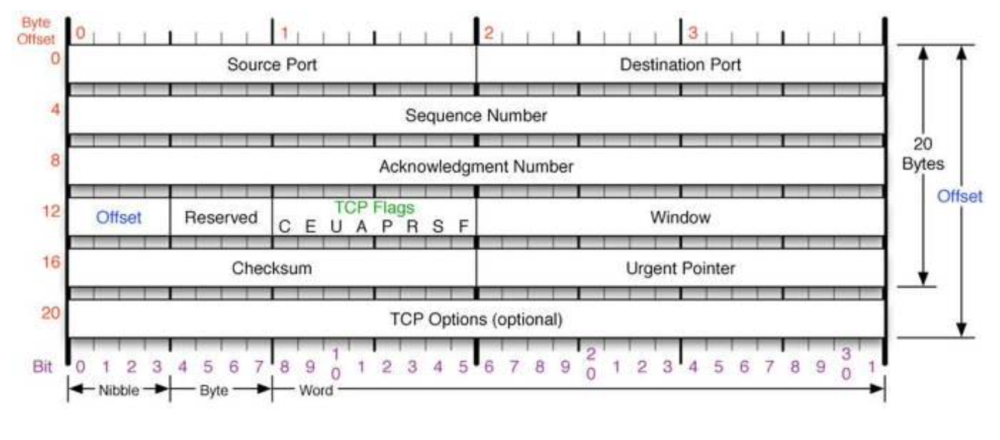
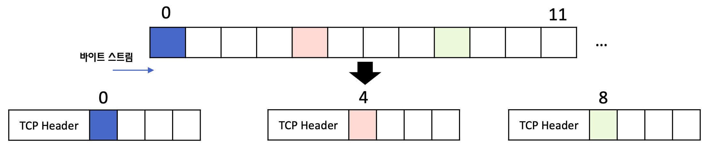
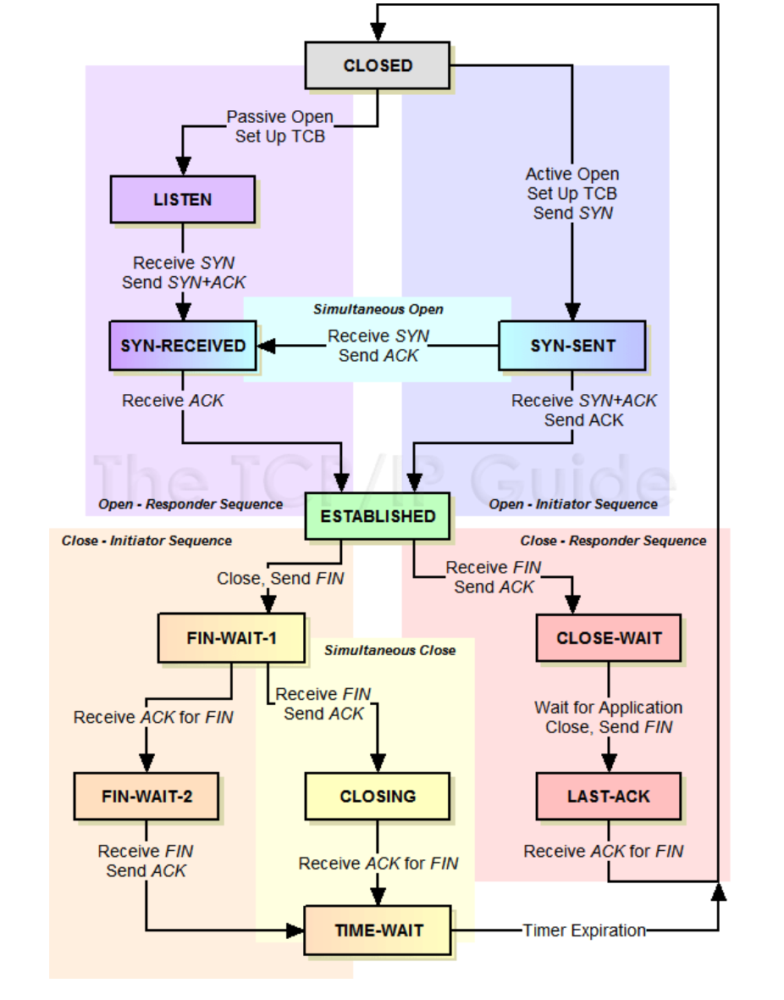
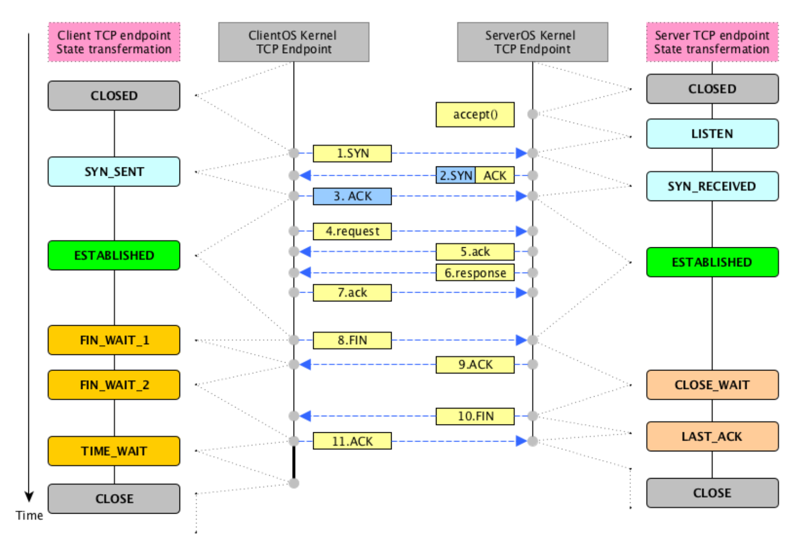
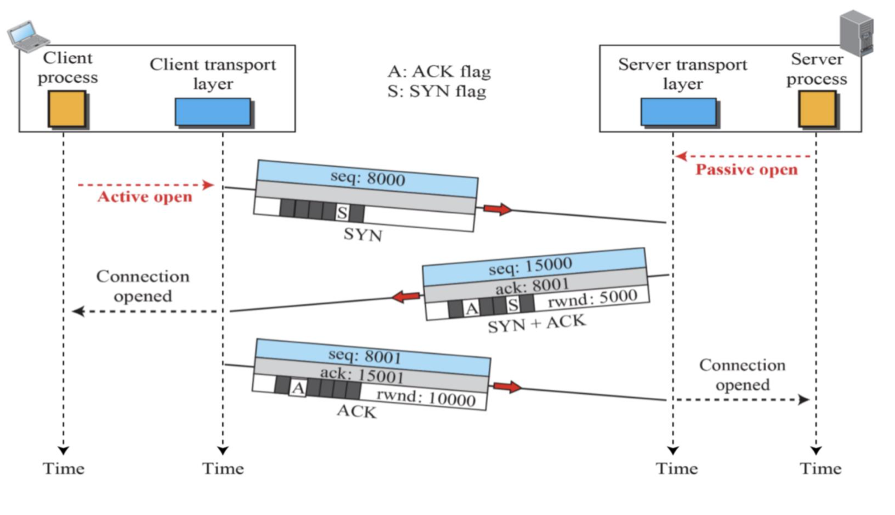
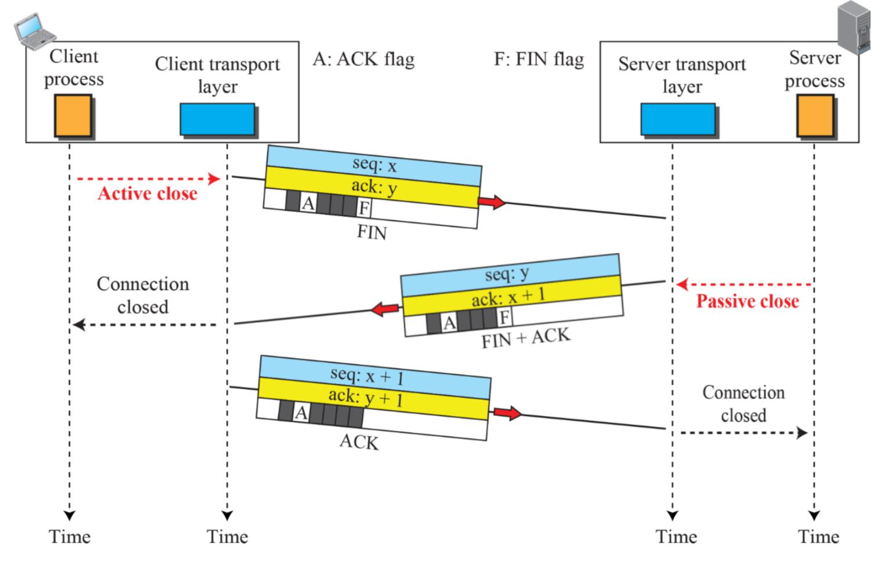
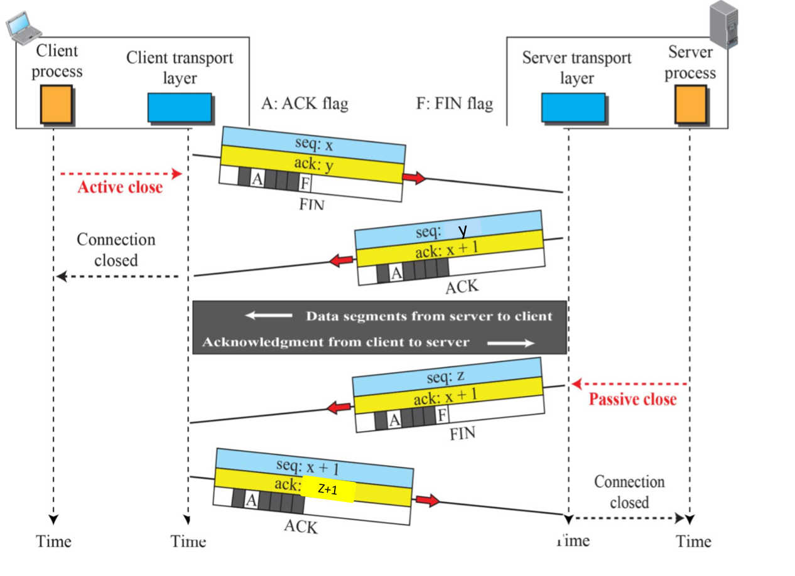
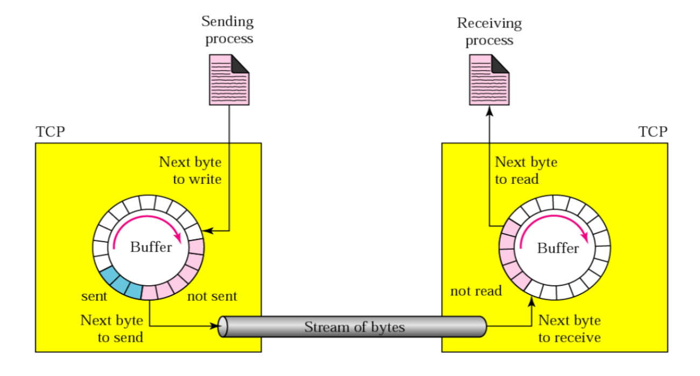
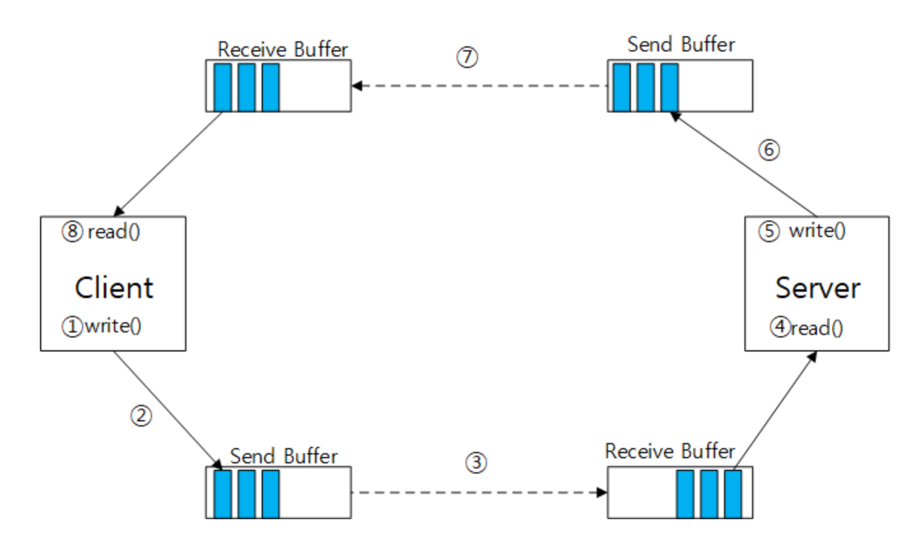
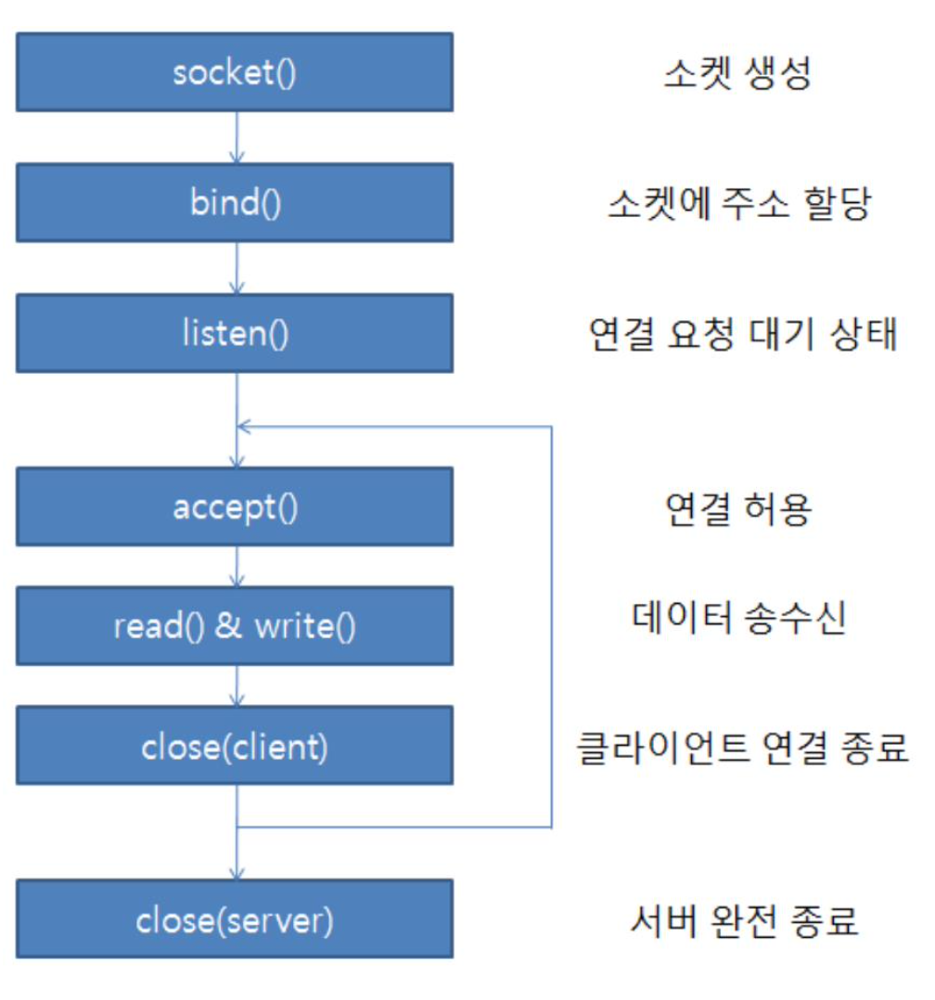

<!--
1. 이미지(가운데 정렬, 60%)
<p align = "center"></p>
<p align = "center">
내용
</p>

-->
# TCP 소켓
## Contents
 1. [TCP 기본](#TCP-기본)
	- [TCP 헤더](#TCP-헤더)
	- [TCP 상태](#TCP-상태)
	- [TCP 연결](#TCP-연결)
	- [TCP 종료](#TCP-종료)
	- [TCP 흐름제어](#TCP-흐름제어)
 1. [서버/클라이언트 분석](#서버/클라이언트-분석)
 1. [Iterative 서버 모델](#Iterative-서버-모델)

***
# TCP 기본
- 전송 계층(Transport Layer)의 핵심 기능은 **호스트 안에서의 프로세스 식별을 통한 데이터의 배달**임
***
## TCP 헤더
- TCP의 기능
	- 호스트 안에서의 프로세스 식별을 통한 데이터의 배달
	- 신뢰적이고 순차적인 데이터 전달
	- `흐름제어`, `혼잡제어`, `오류제어`
<p align = "center"></p>
<p align = "center">
TCP 헤더
</p>

---
- `Source Port`
	- TCP 세그먼트를 보내는 프로세스가 사용하는 포트 번호
- `Destination Port`
	- TCP 세그먼트를 수신하는 프로세스가 사용하는 포트 번호
- `Sequence Number`
	- TCP는 바이트스트림을 쪼개서 전송하게 됨. 따라서 전체 바이트 스트림에서<br>해당 TCP 세그먼트의 번호 중 가장 빠른 번호가 `Sequence Number`로 할당됨
<p align = "center"></p>
<p align = "center">
Sequence Number
</p>

- `Acknowledgement Number`
	- 성공적인 데이터 전달 여부를 상대방에게 알리기 위해 사용하는 번호로,<br>
	수신 노드가 다음에 전송 받을 데이터의 `Sequence Number`가 들어감
- `Header Length`
	- 기본적인 TCP 헤더의 길이는 20바이트(옵션 필드에 따라 변경됨)
	- 값의 단위가 32비트(4바이트)임, 따라서 해당 필드 최소값은 5
- `Reserved Field`
	- 예약 필드 (기능 확장에 사용)
- `TCP Flags`
	- 세그먼트 기능을 표현함

플래그 | 설명
:---:|:---:
CWR|혼잡제어 관련 플래그
ECE|혼잡제어 관련 플래그
URG|긴급 데이터의 포함여부
ACK|Ack 필드 유효성 여부
PSH|긴급한 데이터 전송 요청
RST|TCP 연결 리셋용도
SYN|TCP 연결 시작
FIN|TCP 연결 종료

- Window Size
	- 수신버퍼의 크기를 알리는데 사용됨
- TCP Checksum
	- 세그먼트의 데이터 무결성을 검사하는 비트
- Urgent Pointer
	- 긴급 데이터를 가리키는 포인터
***
## TCP 상태
<p align = "center"></p>
<p align = "center">
TCP 상태
</p>

- `TCB` : TCP Control Block

```
좌측 상단 = Server
우측 상단 = Client

Closed 상태에서 TCP 연결 과정

1. Client가 Server에게 SYN를 보낸다
2. Server는 Client로부터 받은 SYN에 대한 ACK와 자신의 SYN을 보낸다
3. Client는 Server로부터 받은 SYN에 대한 ACK를 보낸다
3. 연결 완료 ESTABLISHED상태가 됨

위 과정은 3-way-handshaking 과정임
```
***
```
좌측 하단 = Client
우측 하단 = Server

ESTABLISHED 상태에서 TCP 종료 과정

<과정 1>
1. Client가 Server에게 FIN을 보낸다
2. Server는 FIN에 대한 ACK를 돌려주고, CLOSE-WAIT상태가 됨
	2-1. Application이 종료 되면 Client에게 FIN을 보냄
	2-2. Server는 LAST-ACK 상태가 됨
3. Client는 Server로부터 ACK를 받고 FIN-WAIT-2 상태가 됨
	3-1. Server로부터 FIN을 받으면 ACK를 돌려줌
4. 연결 종료 CLOSED 상태가 됨


<과정 2>
1. Client가 Server에게 FIN을 보낸다
2. Server는 FIN에 대한 ACK를 돌려주고, 자신도 FIN을 보냄
3. Client는 FIN에 대한 ACK를 돌려준다
4. 연결 종료 CLOSED 상태가 됨
 
```

<p align = "center"></p>
<p align = "center">
TCP 연결과 종료
</p>

***
## TCP 연결
<p align = "center"></p>
<p align = "center">
TCP 연결
</p>

## TCP 종료
<p align = "center"></p>
<p align = "center">
TCP 종료
</p>

- `Half close`:
	- 클라이언트는 최종 메시지를 보내고 종료를 했지만, 서버는 마지막 메시지 수신 후 추가작업을 한 뒤 클라이언트에 보낼 때 필요함

<p align = "center"></p>
<p align = "center">
TCP 종료_Half Close
</p>

***
## TCP 흐름제어
- 송신 버퍼 : 송신 프로세스로부터 생산된 데이터를 받아 수신측에 전송할 데이터를 보관하는 공간
- 수신 버퍼 : 송신측으로부터 전송받은 데이터를 받아 보관하며, 수신 프로세스를 통해 데이터가 소비되는 공간

<p align = "center"></p>
<p align = "center">
TCP 버퍼
</p>

- `TCP Window`
	- `송신 Window` : 수신측의 확인(ACK)없이, 한 번에 전달 할 수 있는 바이트 사이즈
	- `수신 Window` : 수신측에서 수신 할 수 있는 바이트의 사이즈

- TCP 양방향 통신을 위해서는 서버와 클라이언트 모두 `송신`, `수신`윈도우를 가져야 하며 총 4개의 윈도우가 있어야 함
***
# 서버/클라이언트 분석
- 서버 소켓 생성
```c
socket(AF_INET, SOCK_STREAM, IPPROTO_TCP)
socket(AF_INET, SOCK_STREAM, 0)
```
- socket()함수의 2번째 인자로 소켓의 종류 선택
- 3번째 인자로 0을 선택하면 해당 소켓의 대표 프로토콜이 선택 됨
	- SOCK_STREAM의 경우 TCP 프로토콜임

```c
#define PORT 9001
int main(){
	int srvSd;
	struct sockaddr_in srvAddr;

	...

	srvSd = socket(AF_INET, SOCK_STREAM, 0);	// 소켓 생성
	
	...

	srvAddr.sin_family = AF_INET;
	srvAddr.sin_addr.s_addr = htonl(INADDR_ANY);	// IP주소 0.0.0.0으로 설정, 모든 IP로부터 접속 허용
	srvAddr.sin_port = htons(PORT);

	...

	if(bind(srvSd, (struct sockaddr *) &srvAddr, sizeof(srvAddr)) == -1)	// 소켓 바인드

		...

	if(listen(srvSd, 5) == -1)		// 수동형 열기 (CLOSED -> LISTEN)
```

***
- 서버의 TCP 연결과 읽기/쓰기
```c
...
clntSd = accept(srvSd, (struct sockaddr*)&clntAddr, &clntAddrLen);		// TCP연결 파일디스크립터 반환

...

readLen = read(clntSd, rBuff, sizeof(rBuff)-1);					// TCP 읽기

...

write(clntSd, wBuff, sizeof(wBuff));						// TCP 쓰기
```
<p align = "center"></p>
<p align = "center">
TCP 연결과 읽기/쓰기
</p>

- 클라이언트 연결 요청
```c
#define PORT 9001

int main(){
	int clntSd;
	struct sockaddr_in clntAddr;

	...

	clntSd = socket(PF_INET, SOCK_STREAM, 0);			// 소켓 생성

	...

	clntAddr.sin_family = AF_INET;
	clntAddr.sin_addr.s_addr = inet_addr("127.0.0.1");			// 루프백
	clntAddr.sin_port = htons(PORT);		// 소켓 주초제 초기화 (접속할 주소 및 포트 설정)

	...

	if(connect(clntSd, (struct sockaddr *)&clntAddr, sizeof(clntAddr)) == -1)	
	// 소켓 연결 시, TCP 상태는 ESTABLISHED로 변함
```
***

# Iterative 서버 모델
- Concurrent 서버 모델
	- 동시에 여러 클라이언트에게 서비스를 제공함
- Iterative 서버 모델
	- 다수의 클라이언트들에게 순차적인 서비스를 제공함

<p align = "center"></p>
<p align = "center">
Iterative 모델
</p>

***
- 서버
```c
#include <stdio.h>
#include <sys/socket.h>
#include <sys/types.h>
#include <netinet/in.h>
#include <string.h>
#include <errno.h>
#include <stdlib.h>
#include <arpa/inet.h>

void error_proc();

int main(int argc, char** argv){
	int srvSd, clntSd;
	struct sockaddr_in srvAddr, clntAddr;
	int clntAddrLen, readLen, strLen;
	char rBuff[BUFSIZ];
	if(argc != 2){
		printf("Usage: %s [port] \n", argv[0]);
		exit(1);
	}
	printf("Server start...\n");

	srvSd = socket(AF_INET, SOCK_STREAM, IPPROTO_TCP);
	if(srvSd == -1) error_proc();

	memset(&srvAddr, 0, sizeof(srvAddr));
	srvAddr.sin_addr.s_addr = htonl(INADDR_ANY);
	srvAddr.sin_family = AF_INET;
	srvAddr.sin_port = htons(atoi(argv[1]));

	if(bind(srvSd, (struct sockaddr *)&srvAddr, sizeof(srvAddr)) == -1)
		error_proc();
	if(listen(srvSd, 2) < 0)
		error_proc();
	clntAddrLen = sizeof(clntAddr);

	while(1){
		clntSd = accept(srvSd, (struct sockaddr *) &clntAddr, &clntAddrLen);
		if(clntSd == -1) error_proc();
		printf("client %s:%d is connected...\n",
		inet_ntoa(clntAddr.sin_addr),
			ntohs(clntAddr.sin_port));
		while(1){
			readLen = read(clntSd, rBuff, sizeof(rBuff) -1);
			if(readLen == 0) break;
			rBuff[readLen] = '\0';
			printf("Client(%d): %s\n", ntohs(clntAddr.sin_port), rBuff);
			write(clntSd, rBuff, strlen(rBuff));
		}
		close(clntSd);
	}
	close(srvSd);
	return 0;
}

void erroc_proc(){
	fprintf(stderr, "Error: %s \n", strerror(errno));
	exit(1);
}
```
***
- 클라이언트
```c
#include <stdio.h>
#include <sys/socket.h>
#include <sys/types.h>
#include <string.h>
#include <errno.h>
#include <stdlib.h>
#include <arpa/inet.h>

void error_proc();

int main(int argc, char** argv){
	int clntSd;
	struct sockaddr_in clntAddr;
	int clntAddrLen, readLen, recvByte, maxBuff;
	char rBuff[BUFSIZ];
	char wBuff[BUFSIZ];

	if(argc != 3){
		printf("Usage: %s [IP Address] [port] \n", argv[0]);
	}

	clntSd = socket(AF_INET, SOCK_STREAM, 0);
	if(clntSd == -1) error_proc();
	printf("=== clinet program ====\n");

	memset(&clntAddr, 0, sizeof(clntAddr));
	clntAddr.sin_addr.s_addr = inet_addr(argv[1]);
	clntAddr.sin_family = AF_INET;
	clntAddr.sin_port = htons(atoi(argv[2]));

	if(connect(clntSd, (struct sockaddr*) &clntAddr, sizeof(clntAddr)) = =-1){
		close(clntSd);
		error_proc();
	}

	while(1){
		fgets(wBuff, BUFSIZ-1, stdin);
		readLen = strlen(wBuff);
		if(readLen < 2) continue;
		write(clntSd, wBuff, readLen-1);
		recvByte = 0;
		maxBuff = BUFSIZ-1;
		do{
			recvByte += read(clntSd, rBuff, maxBuff);
			maxBuff -= recvByte;
		}while(recvByte < (readLen-1));
		rBuff[recvByte] = '\0';
		printf("Server: %s\n", rBuff);
		wBuff[readLen-1] = '\0';
		if(!strcmp(wBuff, "END")) break;
	}
	printf("END ^^\n");
	close(clntSd);

	return 0;
}

void error_proc(){
	fprintf(stderr, "Error: %s\n", strerror(errno));
	exit(errno);
}
```
***
