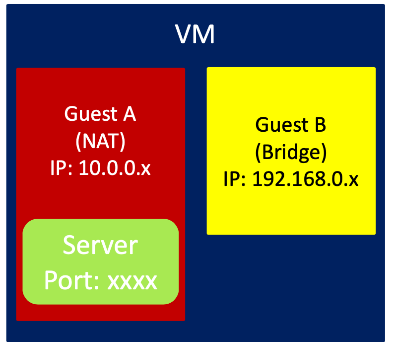
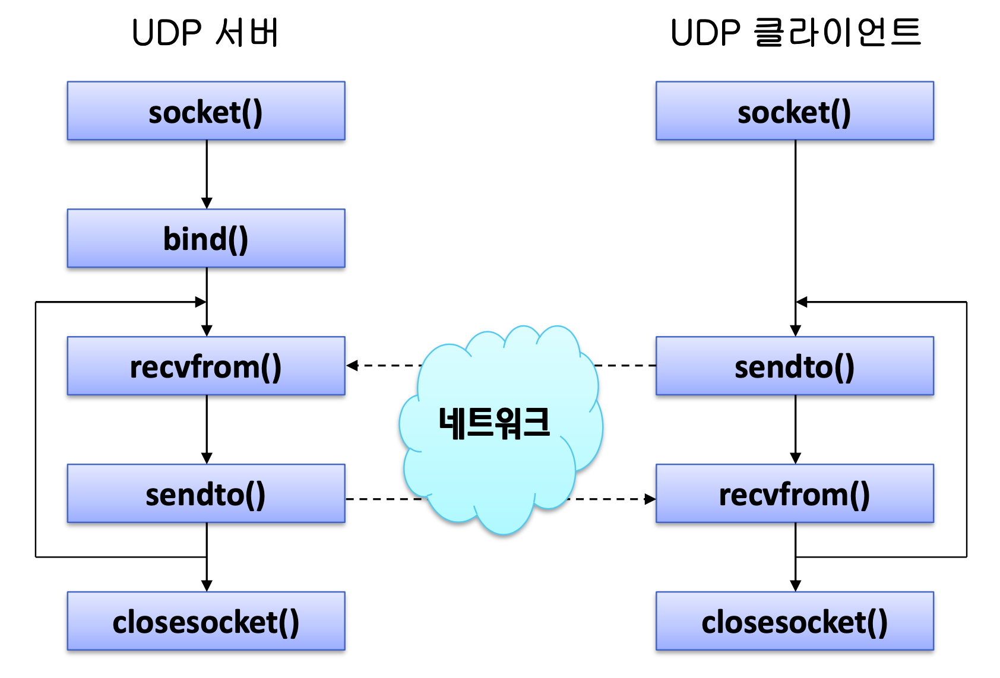

<!--
1. 이미지(가운데 정렬, 60%)
<p align = "center"></p>
<p align = "center">
내용
</p>

-->
# UDP 소켓
## Contents
1. [포트 포워딩](#포트-포워딩)
1. [UDP 기본](#UDP-기본)
1. [UDP 서버/클라이언트 분석](#UDP-서버/클라이언트-분석)
	- [UDP 데이터 전송](#UDP-데이터-전송)
		- [sendto()](#sendto())
			- [sendto() 예제](#sendto()-예제)
		- [recvfrom()](#recvfrom())
			- [recvfrom() 예제](#recvfrom()-예제)
1. [UDP 소켓의 특징](#UDP-소켓의-특징)
1. [UDP 패킷 모니터링](#UDP-패킷-모니터링)
***
# 포트 포워딩
- `Host A 192.168.0.a`, `Host B 192.168.0.b`, `Host C 192.168.0.c`가 존재하고,<br>
Host A의 VM에 `Guest A(NAT) 10.0.2.15`, `Guest B(Bridge) 192.168.0.16`이 있다고 하자

- 포트포워딩이 설정될 경우, `Guest B`, `Host B`, `Host C`가 `192.168.0.a`의 포트 번호 xxxx로 패킷을 보낼 경우,<br>
해당 패킷은 `Guest A`의 서버로 전달 됨
<p align = "center"></p>
<p align = "left"></p>
<p align = "center">
포트포워딩
</p>

***
# UDP 기본
- `UDP(USer Datagram Protocol)`은 호스트 안에서의 프로세스 식별을 통한 데이터 전송을 수행하는 포로토콜임
	- `TCP`와 달리 `신뢰성(Reliable)`한 데이터 전송을 보장하지 않음
	- 즉, `순차적인 데이터 전달`, `혼잡제어`, `흐름제어` 등을 수행하지 않음

TCP|UDP
:---:|:---:
연결 지향|비연결형
신뢰적인 데이터 전송(ACK을 통한 전송확인|성공적인 데이터 전송을 보장하지 않음
순차적인 데이터 전송(Seq)|순차적인 데이터 전송을 보장하지 않음
상대적으로 큰 헤더 사이즈|상대적으로 작은 헤더 사이즈
흐름제어 및 혼잡제어 제공|흐름제어 및 혼잡 제어를 하지 않음
***

- UDP의 특징
	- 연결 설정을 하지 않으므로 `connect()`함수 불필요
	- 프로토콜 수준에서 신뢰성 있는 데이터 전송을 보장하지 않으므로, 필요하다면<br>
	**응용 프로그램 수준에서 신뢰성 있는 데이터 전송 기능을 구현해야 함**
	- 간단한 소켓 함수 호출 절차만 따르면 다자 간 통신을 쉽게 구현할 수 있음

***
# UDP 서버/클라이언트 분석

<p align = "center"></p>
<p align = "center">
UDP 서버-클라이언트 예제 동작
</p>

- UDP 소켓 생성
```c
socket(AF_INET, SOCK_DGRAM, IPPROTO_UDP)
socket(AF_INET, SOCK_DGRAM, 0)
```
	- TCP 소켓과 동일하게 2번째 인자로 소켓의 종류를 선택하고<br>
	3번째 인자로 0을 선택하면 해당 소켓의 종류를 대표하는 프로토콜이 선택된다

***
## UDP 데이터 전송
### sendto()
```c
#include <sys/types.h>
#include <sys/socket.h>

ssize_t sendto(int sockfd, const void* buf, size_t len, int flags,
		const struct sockaddr* dest_addr, socklen_t addrlen);
```
- Arguments
	- `sockfd` : 보내는 소켓의 파일 디스크립터
	- `buf` : 보내진 메시지를 포함하는 버퍼
	- `len` : 메시지의 크기(Bytes)
	- `flags` : 옵션
	- `dest_addr` : dest 주소를 포함하는 sockaddr 구조체 형식
	- `addrlen` : sockaddr의 크기(길이)
- Return value
	- 성공 시, 보내진 데이터 크기 반환(Bytes), 실패 시 -1 리턴
***
#### sendto() 예제
```c
#include <sys/types.h>
#include <sys/socket.h>
#include <stdio.h>
#include <sys/socket.h>
#include <sys/types.h>
#include <netinet/in.h>
#include <string.h>
#include <errno.h>
#include <stdlib.h>
#include <unistd.h>
#include <arpa/inet.h>

void errorProc(const char*);
int main(int argc, char** argv){
	int mySock, readLen, nSent;
	char buff[BUFSIZ];
	struct sockaddr_in destAddr;
	socklen_t addrLen;

	mySock = socket(AF_INET, SOCK_DGRAM, IPPROTO_UDP);	// UDP socket
	memset(&destAddr, 0, sizeof(destAddr));			// Init 0
	destAddr.sin_addr.s_addr = inet_addr(argv[1]);		// Input IP addr
	destAddr.sin_family = AF_INET;						// IPv4
	destAddr.sin_port = htons(atoi(argv[2]));			// Input Port num
	addrLen = sizeof(destAddr);

	while(1){
		fgets(buff, BUFSIZ-1, stdin);
		readLen = strlen(buff);
		nSent = sendto(mySock, buff, readLen, 0, (struct sockaddr*)&destAddr, addrLen);
		// Sending Message
		printf("%d bytes were sent. \n", nSent);
	}
	close(mySock);
	return 0;
}
void errorProc(const char* str){
	fprintf(stderr, "%s: %s \n", str, strerror(errno));
	exit(1);
}
```
***
### recvfrom()
```c
#include <sys/types.h>
#include <sys/socket.h>

ssize_t recvfrom(int sockfd, vodi* buf, size_t len, int flags,
		struct sockaddr* src_addr, socklen_t* addrlen);
```
- Arguments
	- `sockfd` : 보내는 소켓의 파일 디스크립터
	- `buf` : 메시지를 저장하는 버퍼
	- `len` : 버퍼의 크기(Bytes)
	- `flags` : 옵션
	- `dest_addr` : dest 주소를 포함하는 sockaddr 구조체 형식
	- `addrlen` : sockaddr의 크기(길이)
- Return value
	- 성공 시, 받은 데이터 크기 반환(Bytes), 실패 시 -1 리턴
***
#### recvfrom() 예제

```c
#include <stdio.h>
#include <sys/socket.h>
#include <sys/types.h>
#include <netinet/in.h>
#include <string.h>
#include <errno.h>
#include <stdlib.h>
#include <unistd.h>
#include <arpa/inet.h>

void errorProc(const char*);
int main(int argc, char** argv){
	int mySock, readLen, nRecv, res;
	char buff[BUFSIZ];
	struct sockaddr_in srcAddr, destAddr;
	socklen_t addrLen;

	if(argc != 2){
		fprintf(stderr, "Usage: %s Port", argv[0]);
		return 0;
	}

	mySock = socket(AF_INET, SOCK_DGRAM, IPPROTO_UDP);	// UDP socket
	if(mySock == -1) errorProc("socket");
	memset(&srcAddr, 0, sizeof(srcAddr));			// Init 0
	srcAddr.sin_addr.s_addr = htonl(INADDR_ANY);		// Input IP addr
	srcAddr.sin_family = AF_INET;				// IPv4
	srcAddr.sin_port = htons(atoi(argv[1]));		// Input Port num

	res = bind(mySock, (struct sockaddr*)&srcAddr, sizeof(srcAddr));
	if (res == -1) errorProc("bind");
	addrLen = sizeof(destAddr);

	while(1){
		nRecv = recvfrom(mySock, buff, BUFSIZ-1, 0, (struct sockaddr*)&destAddr, &addrLen);
		// Receiving Message
		if(nRecv == -1) errorProc("recvfrom");
		printf("%d bytes were recv. \n", nRecv);
	}
	close(mySock);
	return 0;
}
void errorProc(const char* str){
	fprintf(stderr, "%s: %s \n", str, strerror(errno));
	exit(1);
}
```

***
<p align = "center"></p>
<p align = "center">
sendto.c, recvfrom.c 실행
</p>

- 서버를 구동시키 않아도 메시지가 전송된다
<br>(수신측의 데이터 수신 성공여부를 확인하지 않음)
***
<p align = "center"></p>
<p align = "center">
sendto.c, recvfrom.c 실행2
</p>

- 서버 구동 후 실행 결과
***
- UDP 서버-클라이언트 모델의 경우 2가지가 존재한다

<p align = "center"></p>
<p align = "center">
UDP 서버-클라이언트 모델1
</p>

<p align = "center"></p>
<p align = "center">
UDP 서버-클라이언트 모델2
</p>

***
# UDP 소켓의 특징
- bind() 함수를 호출해서 포트 번호를 지정 가능하다
	- bind()함수를 사용하지 않으면 sendto()에 의해 임의로 포트 번호가 지정됨
```c
mySock = socket(AF_INET, SOCK_DGRAM, IPPROTO_UDP);	// UDP socket
if(mySock == -1) errorProc("socket");
memset(&srcAddr, 0, sizeof(srcAddr));			// Init 0
srcAddr.sin_addr.s_addr = htonl(INADDR_ANY);		// Input IP addr
srcAddr.sin_family = AF_INET;				// IPv4
srcAddr.sin_port = htons(atoi(argv[1]));		// Input Port num

res = bind(mySock, (struct sockaddr*)&srcAddr, sizeof(srcAddr));
if (res == -1) errorProc("bind");
```
***

- connect() 함수의 역할
	- UDP 소켓은 sendto() 혹은 recvfrom()함수를 호출 했을 때만 커널과 연결됨
		- 함수 호출이 종료되면 커널과의 연결이 해제됨
		- 소켓의 연결과 해제에는 오버헤드가 존재함
	- UDP 소켓에 connect()함수를 사용할 경우
		- read(), write() 함수를 사용할 수 있음
		- 연결과 해제에 관련된 오버헤드가 줄음
		- ICMP Port Unreachable 메시지 확인 가능
		- **단, 하나의 UDP 소켓으로 여러 프로세스들과 통신가능하다는 장점은 사라짐**
***
```c
// connected UDP
while(1){
	fgets(buff, BUFSIZ-1, stdin);
	readLen = strlen(buff);
	nSent = write(mySock, buff, readLen);	// write()로 메시지 전송
	printf("%d bytes were sent. \n", nSent);

	nRecv = read(mySock, buff, BUFSIZ-1);	// read()로 메시지 수신
	buff[nRecv] = '\0';
	printf("Server: %s\n", buff);
```
***
- echoServer.c

```c
#include <stdio.h>
#include <sys/socket.h>
#include <sys/types.h>
#include <netinet/in.h>
#include <string.h>
#include <errno.h>
#include <stdlib.h>
#include <arpa/inet.h>

void errProc(const char*);
int main(int argc, char** argv)
{
	int mySock,readLen, nRecv, res;
	char buff[BUFSIZ];
	char * strAddr;
	struct sockaddr_in srcAddr, destAddr;
	socklen_t addrLen;

	if(argc != 2) {
		fprintf(stderr,"Usage: %s Port",argv[0]);
		return 0;  
	}	
	mySock = socket(AF_INET, SOCK_DGRAM, IPPROTO_UDP);
	if(mySock == -1) errProc("socket");	
	memset(&srcAddr, 0, sizeof(srcAddr));
	srcAddr.sin_addr.s_addr = htonl(INADDR_ANY);	
	srcAddr.sin_family = AF_INET;
	srcAddr.sin_port = htons(atoi(argv[1]));

	res = bind(mySock,(struct sockaddr *) &srcAddr,
			sizeof(srcAddr));	
	if(res == -1) errProc("bind");
	addrLen = sizeof(destAddr);
	while(1)
	{
		nRecv = recvfrom(mySock, buff, BUFSIZ-1 , 0,
			(struct sockaddr *) &destAddr,
			&addrLen);
		if(nRecv == -1) errProc("recvfrom");
		if(nRecv > 0) buff[nRecv-1]='\0';
		else buff[nRecv] = '\0';
		strAddr = inet_ntoa(destAddr.sin_addr);
		printf("%s:%d>%s\n",strAddr,ntohs(destAddr.sin_port),buff);
		nRecv = strlen(buff);	
		sendto(mySock, buff, nRecv, 0, 
			(struct sockaddr *) &destAddr, addrLen);		
	}	
	return 0;
}

void errProc(const char* str)
{
	fprintf(stderr,"%s: %s \n", str, strerror(errno));
	exit(1);
}
```
***
- echoClient.c
```c
#include <stdio.h>
#include <sys/socket.h>
#include <sys/types.h>
#include <netinet/in.h>
#include <string.h>
#include <errno.h>
#include <stdlib.h>
#include <arpa/inet.h>


void errProc(const char*);
int main(int argc, char** argv)
{
	int mySock,readLen, nSent, nRecv;
	char buff[BUFSIZ];
	char strAddr;
	struct sockaddr_in destAddr;
	socklen_t addrLen;	
	
	mySock = socket(AF_INET, SOCK_DGRAM, IPPROTO_UDP);
	
	memset(&destAddr, 0, sizeof(destAddr));	
	destAddr.sin_addr.s_addr = inet_addr(argv[1]);	
	destAddr.sin_family = AF_INET;
	destAddr.sin_port = htons(atoi(argv[2]));
	addrLen = sizeof(destAddr);

	while(1)
	{
		fgets(buff, BUFSIZ-1, stdin);
 		readLen = strlen(buff);
		nSent = sendto(mySock, buff, readLen, 0,
			(struct sockaddr*) &destAddr, addrLen);
		if(nSent == -1) errProc("write");
		nRecv = recvfrom(mySock, buff, BUFSIZ-1, 0, 
			(struct sockaddr*) &destAddr, &addrLen);
		if(nRecv == -1) errProc("read");
		buff[nRecv] = '\0';
		printf("Server: %s\n", buff);
		if(!strcmp(buff,"END")) break;
	}	
	return 0;
}

void errProc(const char* str)
{
	fprintf(stderr,"%s: %s \n", str, strerror(errno));
	exit(1);
}

```
***
<p align = "center"></p>
<p align = "center">
echoServer.c and echoClient.c 실행
</p>
